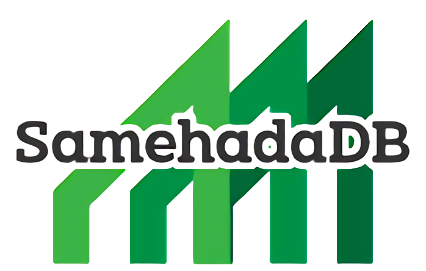

# Overview
- Simple Relational Database Implemented in Golang
- Origin of SamehadaDB is Golang ported [BusTub](https://github.com/cmu-db/bustub) RDBMS: [go-bustub](https://github.com/brunocalza/go-bustub)

# What is Samehada?
- Samehada, which literally means shark skin, is a tool used to grate wasabi, usually for sushi, but also for other Japanese cuisines
- Samehada features its grid shape that forms air bubbles between the grated wasabi, minimizing unnecessary spiciness
- We are proud to call SamehadaDB because the grid produces a pleasant taste and aroma with a nice harmony
- (The text in this section was contributed by [ujihisa](https://github.com/ujihisa). Thanks ujihisa)

# Current Status
- SamehadaDB can be used as simple embedded DB (library form)
  - [Simple Single Page Application Demo (TODO App)](http://ryogrid.net:8088/todo/)))
  - Above demo uses SamehadaDB on backend API server
    - [Modification for migration from PostgreSQL to SamehadaDB (please see backend/api/api.go)](https://github.com/ryogrid/TODO-Fullstack-App-Go-Gin-Postgres-React/compare/273ca76aebac16bc344861ec2ddca147b2c6f86d...5ee4feb72471d16231cc4f4c5e774ab902a0b402)
    - [All app codes](https://github.com/ryogrid/TODO-Fullstack-App-Go-Gin-Postgres-React/tree/5ee4feb72471d16231cc4f4c5e774ab902a0b402)
      - builded frontend JS code is little bit modified directly for escape from re-compile...
      - above code tree can be deployed to AWS Elastic Beanstalk (on not https and use 8088 port)
- And can be used as DB server which offers REST API I/F
  - Please see server directory and [this note](https://gist.github.com/ryogrid/6beee126af2aaebd160a0497c2c9611f)
  - The server binds on http://0.0.0.0:19999/Query (this means localhost, 127.0.0.1, other IP addresses your machine has)
  - There are Win binary and Linux binary at Release page
    - if Linux one runs without error at lauch, you are lucky :)
    - when error occurs, you need to build by myself :)
      - **please check and modify if needed that value of EnableOnMemStorage constant is false (/lib/common/config.go)**
  - there is simple client which can use on browser in demo-client dir
    - very simple SPA. requirement is web browser which can executes JS only :)
    - little bit customized version is pleced at [demo site](http://ryogrid.s3-website-ap-northeast-1.amazonaws.com/samehada-client/index.html)
      - ryogrid.net:19999 is public SamehadaDBd server for demonstration
        - **Do not insert private or secret information/data! the server does not isolation**
- **ATTENTION: SamehadaDB is not developed for productional use! There are no warranties!**
- By the way, procedure described on next section executes almost all defined unit tests except these of taking long time

## Procedure of Executing SamehadaDB (executing unit tests)
- Please install golang environment with package system your OS has (apt, yum, brew ...etc)
  - If you use Windows, you can select both Windows native environment and WSL Ubuntu environment
- If you select Windows native environments or golang environment which is installed with package system can't execute SamehadaDB, you should install official binary directly
  - Please refer [Download and Install - The Go Programming Language](https://go.dev/doc/install)
- Executing all unit tests which test several features and components of SamehadaDB except several tests taking long time
  - $ git clone https://github.com/ryogrid/SamehadaDB.git
  - $ cd SamehadaDB
  - $ go clean -testcache; go test ./... -short -v

## Roadmap  
- [x] Predicates on Seq Scan
- [x] Multiple Item on Predicate: AND, OR
- [x] Predicates: <, >, <=, >=
- [x] Null [^1]
- [ ] Inline types (<del>integer, varchar, float, boolean</del>, bigint, smallint, decimal, timestamp, datetime and etc)
- [x] Delete Tuple
- [x] Update Tuple
  - <del>RESTRICTION: a condition which update transaction aborts on exists</del>
- [x] LIMIT / OFFSET [^1]
- [x] Varchar
- [x] Persistent Catalog
- [ ] Updating of Table Schema 
- [ ] <del>LRU replacer</del>
- [x] Latches
- [x] Transactions
- [x] Rollback When Abort Occurs
- [x] Logging
- [x] Checkpointing
  - [x] Simple Checkpointing (all transaction block until finish of checkpointing)
  - [ ] Fuzzy Checkpointing (ARIES)
- [x] Recovery from Logs
- [x] Index
  - [x] Hash Index
    - Hash index can be used only equal(==) operator is specified to index having columns
    - When the system exits in not graceful, reconstruction of index data is needed at reboot of system now
  - [x] SkipList Index
    - Alternative of B-tree Index 
  - <del>B-tree Index</del>
  - [ ] Logging/Recovery of Index Data (Redo/Undo)
- [ ] JOIN
  - [x] INNER JOIN (Hash Join, Index Join, Nested Loop Join)
    - Condition specified at ON clause should be composed of single item and can use equal(==) operator only
  - [ ] OUTER JOIN
  - [x] CROSS JOIN
- [x] Aggregations (COUNT, MAX, MIN, SUM on SELECT clause including Group by and Having) [^1]
- [x] Sort (ORDER BY clause) [^1]
- [x] Tuple Level Locking With Strong Strict 2-Phase Locking (SS2PL) Protocol
- [x] Concurrent Execution of Transactions
  - Avoidance of phantom problem is not implemented yet
    - So, current transaction isolation level is **"REPEATABLE READ"**
- [ ] <del>Execution Planning from hard coded SQL like method call I/F (like some kind of embedded DB)</del>
- [x] Execution of Query with SQL string
- [x] Frontend Impl as Embedded DB Library (like SQLite)
  - Currently, functions of the library are not thread safe and concurrent transaction is not supported
- [ ] Deduplication of Result Records (Distinct)
- [x] Query Optimization (Selinger) 
  - cases below are not supported now
    - predicate including OR operation, NOT, IS NULL
    - projection including aggregation
    - LIMIT, ORDER BY
- [ ] AS clause
- [ ] Nested Query
- [ ] DB Connector (Driver) or Other Kind of Network Access Interface
  - [ ] MySQL or PostgreSQL Compatible Protocol
  - [x] REST
- [ ] Deallocate and Reuse Page
  - Need tracking page usage by BufferPoolManager or TableHeap and need bitmap in header page corresponding to the tracking
- [x] Optimization of INSERT
  - <del>Current implementation searches a free space which is enough for insert data with sequential scan from head (this is slow on exsisting large amount of records situation) </del>
- [ ] UNION clause
- [ ] Materialization (implementation of component for temporal teble management)
- [ ] Authentication
  
[^1]: Not supported use on frontend now  

## More Info
- [Wiki on this repo](https://github.com/ryogrid/SamehadaDB/wiki)

## About Skip List Index SamehadaDB has
- [Implementation of On-Disk Concurrent Skip List as an Alternative to B-Tree Index](https://ryogrid.github.io/articles/skiplist_en)

# Advisor
- [kumagi](https://github.com/kumagi) and more!

# Acknowledgement
- 2022 May - present: SamehadaDB project is assisted by OSS community support program of JetBrains s.r.o with offering development tools such as GoLand IDE

# Past work
- [FunnelKVS: Rust implementation of autonomous distributed key-value store which has REST interfaces](https://github.com/ryogrid/rust_dkvs)
