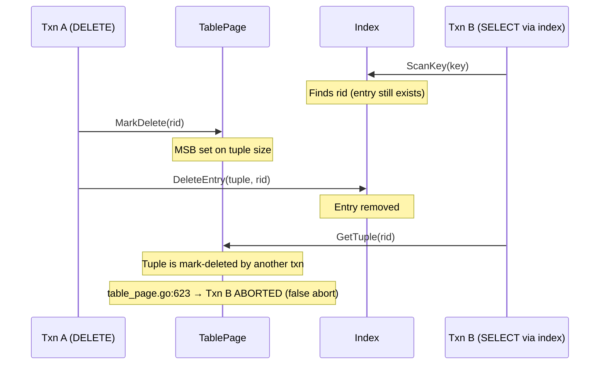
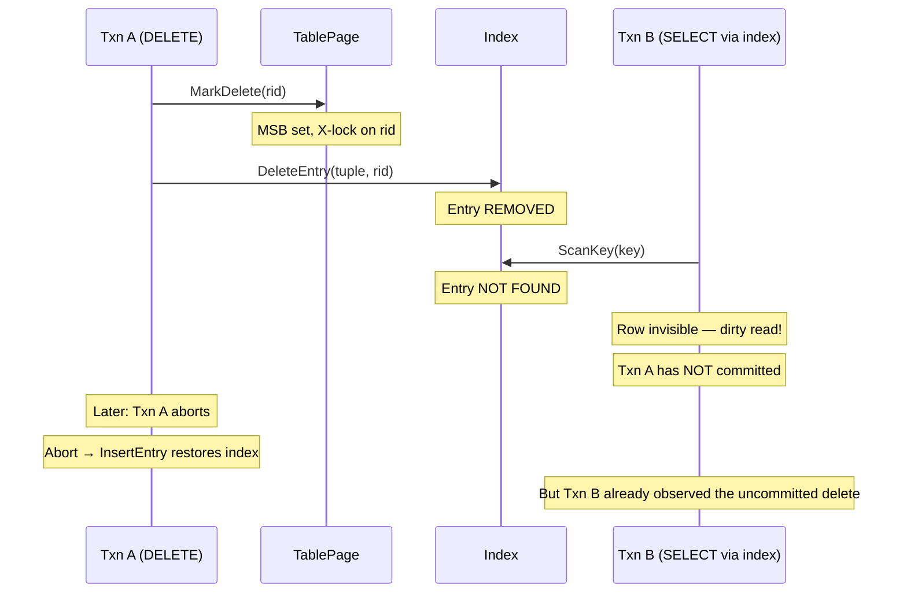

# Problem Analysis: Dirty Read at DELETE

## 1. Problem Summary

SamehadaDB has a **dirty-read bug** when DELETE operations execute concurrently with index scans. Two related problems share the same root cause.

### Problem A: Dirty Read via Index Scan

**Source:** `impl_docs/about_cc/04_tuple_index_consistency.md` §4

`delete_executor.go:71` calls `idx.DeleteEntry()` immediately at execution time. The index entry vanishes before the transaction commits. A concurrent transaction using an index scan will not find the entry, effectively observing an uncommitted delete.

### Problem B: Abort Cannot Undo Observed Anomaly

**Source:** `impl_docs/about_cc/06_rollback_handling.md` §5

Even after `Abort()` re-inserts the index entry (`transaction_manager.go:179`), concurrent transactions may have already observed the missing entry during the window between `DeleteEntry` and `InsertEntry` (rollback).

### Root Cause

Both problems share the **same root cause**: `DeleteEntry` is called at executor time (`delete_executor.go:64-73`), not at commit time. The comment at line 62 says "removing index entry is done at commit phase because delete operation uses marking technique" — but the code contradicts this and removes the index entry immediately.

## 2. Scenario A: False Abort (Index Scan Before DeleteEntry)

**Impact:** Txn B is unnecessarily aborted. Not a data integrity issue, but causes spurious failures.

## 3. Scenario B: Dirty Read (Index Scan After DeleteEntry)

**Impact:** Txn B observes an uncommitted delete. This violates Read Committed isolation.

## 4. Comparison with Other Operations

| Operation | Tuple Step | Index Step | Dirty Read? |
|---|---|---|---|
| **INSERT** | `InsertTuple` (insert_executor.go:42) | `InsertEntry` (insert_executor.go:54) | No — X-lock prevents read |
| **UPDATE** | `UpdateTuple` (update_executor.go:64) | `UpdateEntry` (update_executor.go:90) | No — atomic under exclusive lock |
| **DELETE** | `MarkDelete` (delete_executor.go:55) | `DeleteEntry` (delete_executor.go:71) | **Yes — entry removed before commit** |
| **Sequential Scan** | N/A (iterates all slots) | N/A | No dirty read — false abort instead |

INSERT and UPDATE are safe because the X-lock on the RID prevents concurrent reads. DELETE's index removal bypasses this protection — the entry is simply gone from the index, so there's nothing to lock against.

Sequential scans don't use the index, so they always find the tuple on the page. `GetTuple` detects the mark-delete flag and aborts the reading transaction (false abort), which is less severe than a dirty read.

## 5. Cross-References

- [impl_docs/about_cc/04_tuple_index_consistency.md](../../impl_docs/about_cc/04_tuple_index_consistency.md) — Full timing analysis of tuple/index consistency
- [impl_docs/about_cc/06_rollback_handling.md](../../impl_docs/about_cc/06_rollback_handling.md) — Rollback processing flows and the dirty-read window
- [impl_docs/about_cc/01_lock_manager.md](../../impl_docs/about_cc/01_lock_manager.md) — No-Wait lock behavior
- [impl_docs/about_cc/07_isolation_guarantees.md](../../impl_docs/about_cc/07_isolation_guarantees.md) — Isolation guarantee analysis
