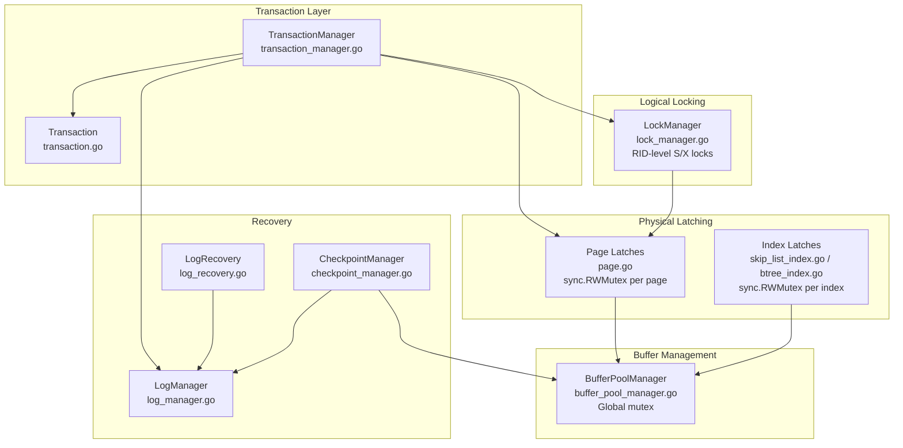
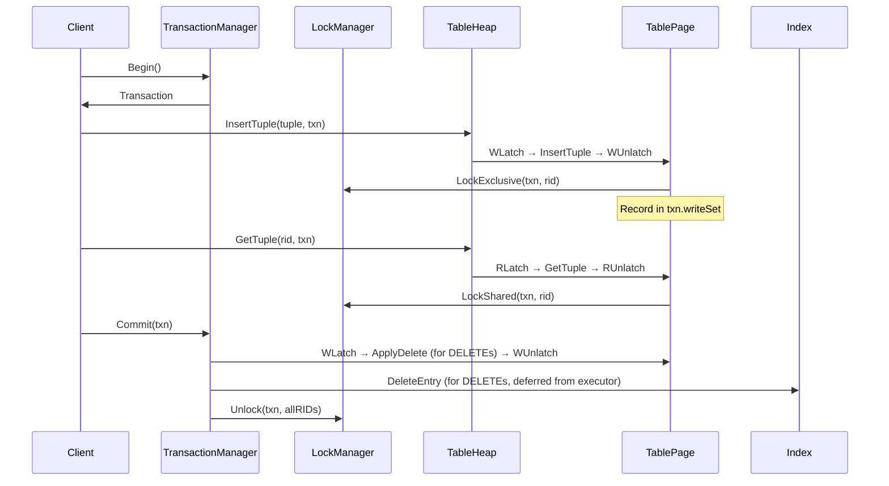

# Concurrency Subsystem Overview

## 1. Architecture

SamehadaDB uses **Strict Two-Phase Locking with No-Wait (SS2PL-NW)** as its concurrency control protocol. The system layers multiple concurrency primitives at different granularities to coordinate access to shared data.



## 2. Component Responsibilities

| Component | File | Responsibility |
|---|---|---|
| **LockManager** | `lib/storage/access/lock_manager.go` | RID-level shared/exclusive locks with No-Wait semantics |
| **TransactionManager** | `lib/storage/access/transaction_manager.go` | Begin/Commit/Abort lifecycle, write-set rollback |
| **Transaction** | `lib/storage/access/transaction.go` | Per-txn state: write set, lock sets, transaction ID |
| **Page (rwLatch)** | `lib/storage/page/page.go` | Per-page RWMutex for physical data access |
| **ReaderWriterLatch** | `lib/common/rwlatch.go` | Wrapper around `sync.RWMutex` with debug support |
| **BufferPoolManager** | `lib/storage/buffer/buffer_pool_manager.go` | Page caching, pin/unpin, eviction (global mutex) |
| **TableHeap** | `lib/storage/access/table_heap.go` | Tuple CRUD with page latch acquisition |
| **TablePage** | `lib/storage/access/table_page.go` | Tuple storage with lock acquisition via LockManager |
| **LogManager** | `lib/recovery/log_manager.go` | WAL append, flush |
| **LogRecovery** | `lib/recovery/log_recovery/log_recovery.go` | Redo/Undo during crash recovery |
| **CheckpointManager** | `lib/concurrency/checkpoint_manager.go` | Periodic checkpoint creation |
| **SkipListIndex** | `lib/storage/index/skip_list_index.go` | Non-unique index with `updateMtx` RWMutex |
| **UniqSkipListIndex** | `lib/storage/index/uniq_skip_list_index.go` | Unique index with `updateMtx` RWMutex |
| **BTreeIndex** | `lib/storage/index/btree_index.go` | B-tree index with `rwMtx` RWMutex |
| **HashTableIndex** | `lib/storage/index/linear_probe_hash_table_index.go` | Hash index with container-level `tableLatch` |

## 3. Latch Hierarchy

Latches must be acquired in the order shown below. Violating this order risks deadlock.

```
globalTxnLatch (TransactionManager)
  └─→ LockManager mutex (single global sync.Mutex)
       └─→ Page latches (per-page sync.RWMutex)
            └─→ Index latches (per-index sync.RWMutex)
                 └─→ Container-internal latches (skip list node latches, hash tableLatch)
                      └─→ LogManager latch
```

**Key rules:**
- The LockManager's global `mutex` is held only briefly during lock table lookups — never while holding page latches.
- Page latches are acquired by `TableHeap` methods (e.g., `GetTuple`, `InsertTuple`) and released before returning.
- Index wrapper latches (`updateMtx`/`rwMtx`) are acquired by index methods and released before returning.
- The BPM `mutex` is acquired/released during `FetchPage`/`UnpinPage` and never held across page latch acquisitions.

## 4. Concurrency Control Protocol Summary

### SS2PL-NW (Strict Two-Phase Locking, No-Wait)

1. **Two-Phase**: Locks are acquired during execution (growing phase) and released only at commit/abort (shrinking phase).
2. **Strict**: All locks — both shared and exclusive — are held until the transaction ends, preventing cascading aborts.
3. **No-Wait**: When a lock request conflicts, the requester immediately fails (returns `false`) rather than blocking. The caller aborts the transaction and retries.

### Lock Types
- **Shared (S)**: Acquired by `TablePage.GetTuple` for reads.
- **Exclusive (X)**: Acquired by `TablePage.InsertTuple`, `UpdateTuple`, `MarkDelete` for writes.
- **Upgrade (S→X)**: Promoted by `UpdateTuple`/`MarkDelete` if the transaction already holds a shared lock.

### Physical Latches vs Logical Locks
- **Locks** (LockManager): Logical, RID-granularity, held until transaction end. Ensure isolation.
- **Latches** (Page/Index): Physical, short-duration, protect in-memory data structures. Not visible to the transaction protocol.

## 5. Transaction Lifecycle



## 6. Known Issues

> ✅ **Fixed: Dirty Read at DELETE via Index**
> Previously, `DeleteEntry` was called at execution time (before commit), allowing concurrent index scans to observe uncommitted deletes. This was fixed by deferring `DeleteEntry` to the commit phase in `TransactionManager.Commit()`. See [04_tuple_index_consistency.md](04_tuple_index_consistency.md) for the analysis and fix details.

> ⚠️ **Known Issue: Crash Recovery Does Not Restore Indexes**
> `LogRecovery.Undo()` restores only table data — index entries are not updated. After a non-graceful shutdown, indexes must be fully rebuilt. See [06_rollback_handling.md](06_rollback_handling.md) for details.

> ⚠️ **Known Issue: Phantom Reads**
> No predicate or gap locking is implemented. Concurrent inserts can produce phantom rows visible to repeated scans. See [07_isolation_guarantees.md](07_isolation_guarantees.md).

## 7. Cross-References

- **WAL and Recovery fundamentals**: [../overview/05_transaction_recovery.md](../overview/05_transaction_recovery.md)
- **LockManager internals**: [01_lock_manager.md](01_lock_manager.md)
- **Page latching patterns**: [02_page_latch_and_pinning.md](02_page_latch_and_pinning.md)
- **Index concurrency**: [03_index_concurrency.md](03_index_concurrency.md)
- **Tuple/index consistency (dirty-read root cause)**: [04_tuple_index_consistency.md](04_tuple_index_consistency.md)
- **UPDATE and RID changes**: [05_update_rollback_rid.md](05_update_rollback_rid.md)
- **Rollback handling**: [06_rollback_handling.md](06_rollback_handling.md)
- **Isolation guarantees**: [07_isolation_guarantees.md](07_isolation_guarantees.md)
