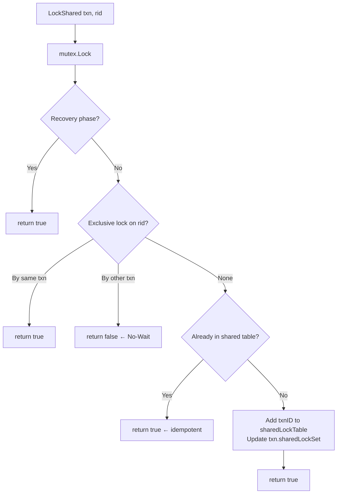
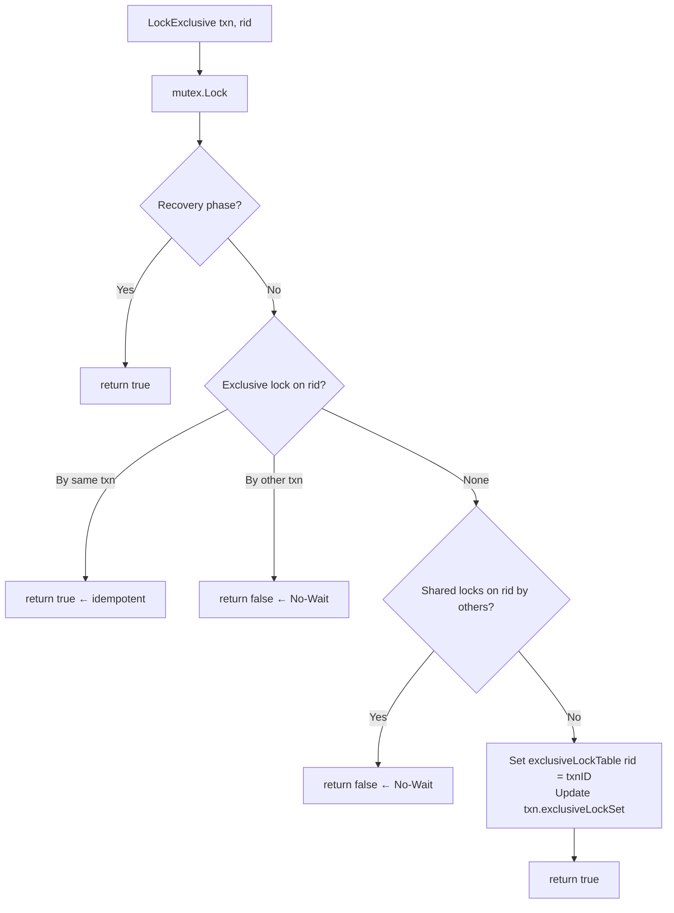

# LockManager Implementation

## 1. Overview

The `LockManager` (`lib/storage/access/lock_manager.go`) implements RID-level shared/exclusive locking with **No-Wait** conflict resolution. It is the central logical locking component of SamehadaDB's SS2PL-NW protocol.

## 2. Data Structures

```go
// lock_manager.go:57-66
type LockManager struct {
    twoPLMode        TwoPLMode
    deadlockMode     DeadlockMode
    mutex            *sync.Mutex                    // Protects both lock tables
    enableCycleDetection bool
    sharedLockTable    map[page.RID][]types.TxnID   // RID → list of txn IDs holding S-lock
    exclusiveLockTable map[page.RID]types.TxnID     // RID → single txn ID holding X-lock
}
```

**Key design choices:**
- Two separate maps rather than a unified lock-request queue — simpler but no queuing or fairness.
- `sharedLockTable` maps to a **slice** of TxnIDs (multiple readers allowed).
- `exclusiveLockTable` maps to a **single** TxnID (exclusive holder).
- A single global `sync.Mutex` protects both tables. Held only during map operations — never across I/O.

### Lock Mode and Request Types

```go
// lock_manager.go:28-33
type LockMode int32
const (
    SHARED    LockMode = iota  // 0
    EXCLUSIVE                   // 1
)
```

The `LockRequest` and `LockRequestQueue` structs (lines 35-52) are defined but not actively used in the current No-Wait implementation — they exist as scaffolding for a potential wait-based mode.

## 3. Lock Compatibility Matrix

| Existing \ Requested | Shared (S) | Exclusive (X) |
|---|---|---|
| **None** | Grant | Grant |
| **Shared (S) by same txn** | Grant (idempotent) | Grant via Upgrade (if sole holder) |
| **Shared (S) by other txn** | Grant | **Fail (No-Wait)** |
| **Exclusive (X) by same txn** | Grant | Grant (idempotent) |
| **Exclusive (X) by other txn** | **Fail (No-Wait)** | **Fail (No-Wait)** |

## 4. LockShared Flow



**Detailed steps** (`lock_manager.go:131-168`):

1. **Line 133**: Acquire `mutex.Lock()`
2. **Line 136-138**: If `txn.IsRecoveryPhase()` → return `true` immediately (bypass all locking)
3. **Line 141-147**: Check `exclusiveLockTable[rid]`:
   - Held by same txn (line 142-143): return `true`
   - Held by different txn (line 144-145): return `false` **(No-Wait fail)**
4. **Line 148-167**: No exclusive conflict:
   - Already in `sharedLockTable` for this txn (line 149-151): return `true`
   - Not present (line 152-166): append txnID to `sharedLockTable[rid]`, add RID to `txn.sharedLockSet`, return `true`

## 5. LockExclusive Flow



**Detailed steps** (`lock_manager.go:176-205`):

1. **Line 178**: Acquire `mutex.Lock()`
2. **Line 181-183**: Recovery phase bypass → return `true`
3. **Line 186-191**: Check `exclusiveLockTable[rid]`:
   - Same txn: return `true`
   - Different txn: return `false` **(No-Wait fail)**
4. **Line 193-198**: Check `sharedLockTable[rid]`:
   - If other txns hold shared locks (line 194): return `false` **(No-Wait fail)**
5. **Line 200-203**: No conflicts → set `exclusiveLockTable[rid] = txnID`, add RID to `txn.exclusiveLockSet`, return `true`

## 6. LockUpgrade Flow (S→X)

**Purpose:** Promote a shared lock to an exclusive lock without releasing and re-acquiring.

**Detailed steps** (`lock_manager.go:213-247`):

1. **Line 215**: Acquire `mutex.Lock()`
2. **Line 218-220**: Recovery phase bypass → return `true`
3. **Line 224-229**: Check `exclusiveLockTable[rid]`:
   - Same txn: return `true` (already upgraded)
   - Different txn: return `false`
4. **Line 232-242**: Check `sharedLockTable[rid]`:
   - More than one txn holds shared lock (line 234-236): return `false` **(No-Wait fail — cannot upgrade with concurrent readers)**
   - Only this txn holds shared lock (line 238-241): install exclusive lock, update lock set, return `true`

**Critical constraint:** Upgrade succeeds only if the requesting transaction is the **sole shared lock holder** on the RID.

## 7. Unlock Flow

**Detailed steps** (`lock_manager.go:255-276`):

1. **Line 256**: Acquire `mutex.Lock()`
2. **Line 258-273**: For each RID in `ridList`:
   - If `exclusiveLockTable[rid]` held by this txn (line 259-264): delete entry
   - If `sharedLockTable[rid]` contains this txn (line 266-271): remove txnID from slice
3. **Line 275**: Return `true` (unlock always succeeds)

Called by `TransactionManager.Commit()` (line 126-128) and `TransactionManager.Abort()` (line 259-267) after all write-set processing is complete.

## 8. No-Wait Semantics

The No-Wait policy means:
- **No wait queue**: There is no `LockRequestQueue` processing. Conflicting requests fail immediately.
- **No blocking**: No `sync.Cond` or channel wait. The mutex is held only during map operations.
- **No deadlock detection**: Deadlocks are impossible because no transaction ever waits.
- **Caller responsibility**: When `LockShared`/`LockExclusive`/`LockUpgrade` returns `false`, the caller sets `txn.SetState(ABORTED)` and returns an error.

**Trade-off:** High abort rate under contention, but zero deadlock risk and simple implementation.

## 9. Recovery Phase Bypass

All three lock-acquisition methods check `txn.IsRecoveryPhase()` before proceeding:

| Method | Bypass Line |
|---|---|
| `LockShared` | 136-138 |
| `LockExclusive` | 181-183 |
| `LockUpgrade` | 218-220 |

During crash recovery, the `LogRecovery` process sets transactions into recovery phase. All lock acquisitions return `true` without actually recording locks, because:
- Recovery runs single-threaded — no concurrent access to protect against.
- Lock tables may contain stale state from the pre-crash session.

## 10. Lock Acquisition Call Sites in TablePage

| TablePage Method | Lock Type | Line | Condition |
|---|---|---|---|
| `InsertTuple` | `LockExclusive` | 107 | Not in recovery phase (line 105) |
| `UpdateTuple` | `LockUpgrade` | 169 | If already shared-locked |
| `UpdateTuple` | `LockExclusive` | 173 | If not yet locked |
| `MarkDelete` | `LockUpgrade` | 285 | If already shared-locked |
| `MarkDelete` | `LockExclusive` | 289 | If not yet locked |
| `GetTuple` | `LockShared` | 570 | If not already shared or exclusively locked (line 569) |

**Failure handling:** All call sites set `txn.SetState(ABORTED)` and return an error when the lock method returns `false`.

## 11. Cross-References

- **Overview**: [00_overview.md](00_overview.md)
- **Page latches (physical-level concurrency)**: [02_page_latch_and_pinning.md](02_page_latch_and_pinning.md)
- **Lock interaction with tuple/index consistency**: [04_tuple_index_consistency.md](04_tuple_index_consistency.md)
- **Lock release during commit/abort**: [06_rollback_handling.md](06_rollback_handling.md)
- **WAL and recovery**: [../overview/05_transaction_recovery.md](../overview/05_transaction_recovery.md)
