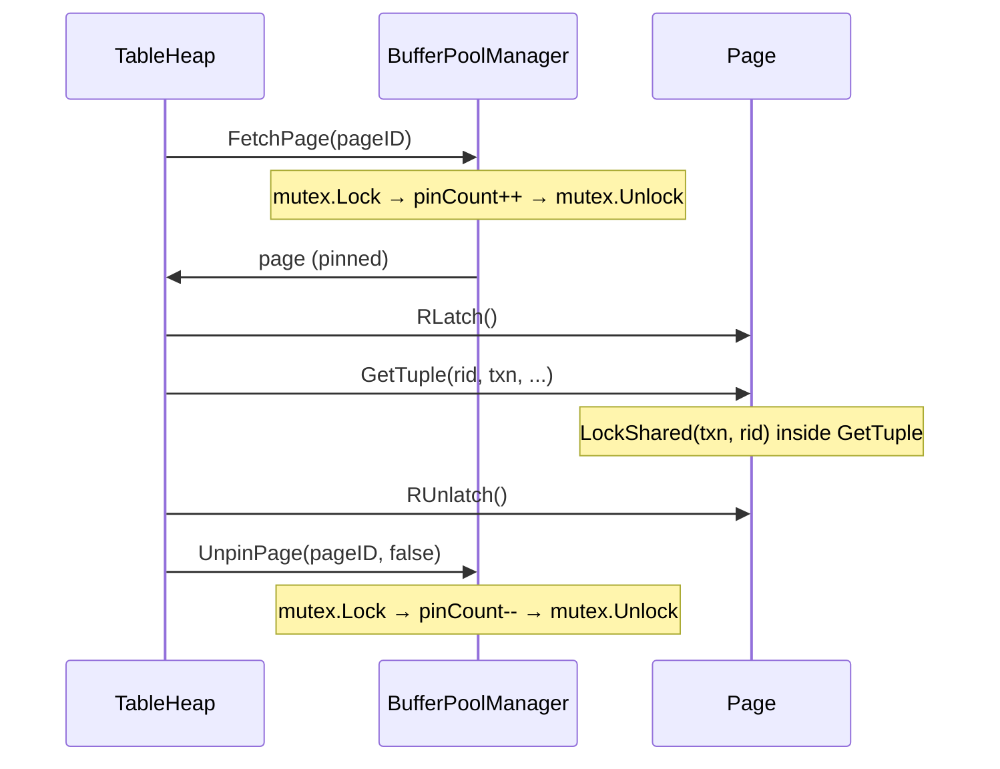

# Page Latch and Buffer Pool Pinning

## 1. Overview

Every in-memory page in SamehadaDB carries two independent concurrency controls:
- **Pin count**: Prevents the buffer pool from evicting a page while it is in use.
- **RW Latch**: Prevents concurrent threads from reading/writing the page's data simultaneously.

These are **physical** protections — short-lived, not part of the transaction protocol. They complement the **logical** locks managed by the [LockManager](01_lock_manager.md).

## 2. Page Structure

```go
// page.go:33-44
type Page struct {
    pinCount int32                          // Atomic reference count
    isDirty  bool                           // Written since last flush
    rwLatch  common.ReaderWriterLatch       // Per-page RWMutex
    // ... data, pageID, debug maps
}
```

### Pin Count Operations

| Method | Line | Semantics |
|---|---|---|
| `IncPinCount()` | 47-51 | `atomic.AddInt32(&p.pinCount, 1)` |
| `DecPinCount()` | 54-61 | `atomic.AddInt32(&p.pinCount, -1)` |
| `PinCount()` | 64-66 | `atomic.LoadInt32(&p.pinCount)` |

Pin count is managed atomically — no latch or mutex required.

### Latch Operations

| Method | Line | Delegates To |
|---|---|---|
| `WLatch()` | 126-133 | `p.rwLatch.WLock()` |
| `WUnlatch()` | 136-142 | `p.rwLatch.WUnlock()` |
| `RLatch()` | 145-151 | `p.rwLatch.RLock()` |
| `RUnlatch()` | 154-160 | `p.rwLatch.RUnlock()` |

The underlying `ReaderWriterLatch` (`lib/common/rwlatch.go:21-53`) wraps Go's `sync.RWMutex`:
- `WLock()` → `mutex.Lock()` (line 35-37)
- `WUnlock()` → `mutex.Unlock()` (line 39-41)
- `RLock()` → `mutex.RLock()` (line 43-45)
- `RUnlock()` → `mutex.RUnlock()` (line 47-49)

Debug variants (`readerWriterLatchDebug`, lines 108-155) track reader/writer counts for testing.

## 3. Pin vs Latch Distinction

| Property | Pin | Latch |
|---|---|---|
| **Purpose** | Prevent eviction from buffer pool | Prevent concurrent data access |
| **Granularity** | Per page | Per page |
| **Duration** | FetchPage → UnpinPage | Latch → Unlatch (within single operation) |
| **Mechanism** | Atomic int32 counter | `sync.RWMutex` |
| **Concurrent holders** | Multiple (reference count) | Multiple readers OR one writer |

**Invariant:** A page's latch should only be held while the page is pinned. The buffer pool cannot evict a pinned page, so the latch protects valid in-memory data.

## 4. Latch Acquisition Patterns in TableHeap

All TableHeap methods follow the same pattern:

```
FetchPage(pageID) → Latch → Operation → UnpinPage → Unlatch
```

> **Note:** UnpinPage is called before Unlatch in most methods. This is safe because the pin count was incremented by FetchPage, and UnpinPage only decrements it. As long as the count remains > 0 (which it does while other operations may also have the page pinned), the page won't be evicted.

### GetTuple (Read Path)



**Code** (`table_heap.go:327-352`):
- Line 345: `FetchPage(rid.GetPageID())`
- Line 346: `page.RLatch()`
- Line 347: `page.GetTuple(rid, ...)`
- Line 348: `page.RUnlatch()`
- Line 349: `bpm.UnpinPage(page.GetPageID(), false)`

### InsertTuple (Write Path)

**Code** (`table_heap.go:63-139`):
- Line 77: `FetchPage(lastPageID)`
- Line 80: `currentPage.WLatch()`
- Line 86: `currentPage.InsertTuple(tpl, ...)`
- If insert fails (page full), unpin and try next page:
  - Line 96: `bpm.UnpinPage(currentPage.GetPageID(), false)`
  - Line 101: `currentPage.WUnlatch()`
  - Allocate new page or fetch next page, repeat
- On success:
  - Line 126: `bpm.UnpinPage(currentPageID, true)` (dirty)
  - Line 131: `currentPage.WUnlatch()`

### MarkDelete (Write Path)

**Code** (`table_heap.go:230-266`):
- Line 243: `FetchPage(rid.GetPageID())`
- Line 250: `pg.WLatch()`
- Line 252: `pg.MarkDelete(rid, txn, ...)`
- Line 253: `bpm.UnpinPage(pg.GetPageID(), true)` (dirty)
- Line 258: `pg.WUnlatch()`

### UpdateTuple (Write Path)

**Code** (`table_heap.go:143-227`):
- Line 156: `FetchPage(rid.GetPageID())`
- Line 166: `pg.WLatch()`
- Line 168: `pg.UpdateTuple(tpl, ...)`
- Line 169: `bpm.UnpinPage(pg.GetPageID(), isUpdated)` (dirty if updated)
- Line 174: `pg.WUnlatch()`
- If update fails due to space → falls back to MarkDelete + InsertTuple (lines 192-202)

### ApplyDelete (Commit-time Physical Delete)

**Code** (`table_heap.go:268-297`):
- Line 281: `FetchPage(rid.GetPageID())`
- Line 284: `pg.WLatch()`
- Line 286: `pg.ApplyDelete(rid, txn, logManager)`
- Line 291: `bpm.UnpinPage(pg.GetPageID(), true)` (dirty)
- Line 296: `pg.WUnlatch()`

## 5. Commit-Time Latch Acquisition

During `TransactionManager.Commit()` (`transaction_manager.go:61-131`), the commit path acquires page WLatches to finalize deletes:

**For DELETE write records** (lines 87-94):
```
FetchPage(pageID) → WLatch → ApplyDelete(rid) → UnpinPage(dirty) → WUnlatch
```

**For UPDATE with RID change** (lines 100-110):
```
FetchPage(old pageID) → WLatch → ApplyDelete(old rid) → UnpinPage(dirty) → WUnlatch
```

This means **commit is not latch-free** — it acquires WLatches on pages that contain marked-deleted tuples.

## 6. BufferPoolManager Mutex Interaction

The BPM uses a single `sync.Mutex` (`buffer_pool_manager.go:26`) to protect its internal state:

### FetchPage (`buffer_pool_manager.go:52-145`)

1. **Line 54**: `mutex.Lock()`
2. **Lines 55-72**: If page is in `pageTable` (cache hit):
   - `IncPinCount()` (line 66), `Pin()` in replacer (line 67)
   - `mutex.Unlock()` (line 68), return page
3. **Lines 76-80**: Find free frame or victim. If no frame available, `mutex.Unlock()`, return nil.
4. **Lines 82-109**: If evicting a dirty victim page:
   - `currentPage.WLatch()` (line 99)
   - Write to disk (line 101)
   - `currentPage.WUnlatch()` (line 102)
5. **Lines 130-139**: Install new page in frame, update `pageTable`
6. **Line 139**: `mutex.Unlock()`
7. Return page with `pinCount = 1`

**Critical ordering:** The BPM mutex is released **before** the caller acquires a page latch. This prevents a latch-ordering violation (BPM mutex → page latch during eviction, page latch → BPM mutex during unpin would deadlock).

### UnpinPage (`buffer_pool_manager.go:149-194`)

1. **Line 151**: `mutex.Lock()`
2. **Line 160**: `pg.DecPinCount()`
3. **Lines 171-173**: If `pinCount ≤ 0`, mark as unpinnable in replacer
4. **Lines 175-179**: Set dirty flag
5. **Line 180**: `mutex.Unlock()`

## 7. Latch Ordering Summary

```
BPM mutex (held briefly during FetchPage/UnpinPage)
  → Page WLatch/RLatch (held during tuple operation)
    → LockManager mutex (held briefly during lock table lookup, inside TablePage methods)
```

This ordering is consistent across all paths. The BPM mutex is always released before page latches are acquired by the caller.

## 8. Cross-References

- **Overview and latch hierarchy**: [00_overview.md](00_overview.md)
- **Logical locking (LockManager)**: [01_lock_manager.md](01_lock_manager.md)
- **Index latching**: [03_index_concurrency.md](03_index_concurrency.md)
- **Tuple/index consistency issues**: [04_tuple_index_consistency.md](04_tuple_index_consistency.md)
- **Commit-time ApplyDelete**: [06_rollback_handling.md](06_rollback_handling.md)
- **Buffer and storage fundamentals**: [../overview/03_buffer_storage.md](../overview/03_buffer_storage.md)
