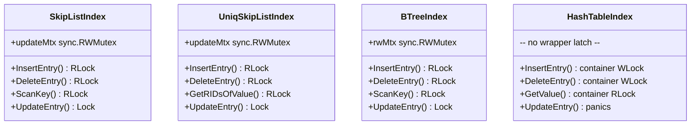

# Index Concurrency Protocols

## 1. Overview

Each index type in SamehadaDB uses its own latch to coordinate concurrent access. Unlike the [LockManager](01_lock_manager.md) (which provides logical, transaction-duration locks on RIDs), index latches are **physical, short-duration mutexes** that protect the index data structure itself.

All index types share a common pattern:
- **Insert/Delete/Scan**: Acquire a **read lock** (RLock) at the wrapper level, allowing concurrent modifications.
- **UpdateEntry**: Acquires a **write lock** (exclusive Lock) at the wrapper level, serializing the atomic delete+insert pair.
- **`isNoLock` parameter**: Skips wrapper-level locking when called from within `UpdateEntry` (which already holds the write lock).

## 2. Per-Index Latch Summary

| Index Type | File | Latch Field | Type | Insert | Delete | Scan | UpdateEntry |
|---|---|---|---|---|---|---|---|
| **SkipListIndex** | `lib/storage/index/skip_list_index.go` | `updateMtx` | `sync.RWMutex` | RLock | RLock | RLock | Lock (exclusive) |
| **UniqSkipListIndex** | `lib/storage/index/uniq_skip_list_index.go` | `updateMtx` | `sync.RWMutex` | RLock | RLock | RLock | Lock (exclusive) |
| **BTreeIndex** | `lib/storage/index/btree_index.go` | `rwMtx` | `sync.RWMutex` | RLock | RLock | RLock | Lock (exclusive) |
| **HashTableIndex** | `lib/storage/index/linear_probe_hash_table_index.go` | (none at wrapper) | — | container WLock | container WLock | container RLock | **panics** |



## 3. SkipListIndex Concurrency

**File:** `lib/storage/index/skip_list_index.go`

### Wrapper-Level Locking

- **`insertEntryInner(key, rid, txn, isNoLock)`** (line 46):
  - If `isNoLock == false`: `slidx.updateMtx.RLock()` before container insert, `RUnlock()` after.
- **`deleteEntryInner(key, rid, txn, isNoLock)`** (line 68):
  - If `isNoLock == false`: `slidx.updateMtx.RLock()` before container remove, `RUnlock()` after.
- **`ScanKey()`** (lines 87-95):
  - `slidx.updateMtx.RLock()` → create range iterator → `slidx.updateMtx.RUnlock()`
- **`UpdateEntry()`** (lines 101-104):
  - `slidx.updateMtx.Lock()` (exclusive) → `deleteEntryInner(isNoLock=true)` → `insertEntryInner(isNoLock=true)` → `slidx.updateMtx.Unlock()`

### Node-Level Latching (Container)

**File:** `lib/container/skip_list/skip_list.go`

The skip list container implements fine-grained node-level latching:

- Each `SkipListBlockPage` inherits `Page`, which has its own `rwLatch`.
- **`FindNode()`** (lines 89-198): Traverses from header, acquiring/releasing node latches:
  - Uses `latchOpWithOpType()` (lines 61-84) to select RLatch for reads, WLatch for writes.
  - Caller receives the found node **with its latch still held** — responsible for releasing.
- **`headerPageLatch`** (line 38): Declared as `common.ReaderWriterLatch` but currently **unused** in the codebase.

### Why Insert/Delete Use RLock (Not WLock)

The wrapper `updateMtx` does **not** protect the container's internal consistency — the container handles that with its own node-level latches. The wrapper mutex exists solely to make `UpdateEntry` (delete + insert) **atomic** with respect to concurrent `ScanKey` calls. RLock for Insert/Delete is sufficient because:

1. Multiple concurrent inserts/deletes are safe — the container's node latches serialize at the node level.
2. Only `UpdateEntry` needs exclusivity at the wrapper level to prevent a scan from seeing a half-updated entry (old deleted, new not yet inserted).

## 4. UniqSkipListIndex Concurrency

**File:** `lib/storage/index/uniq_skip_list_index.go`

Identical latch protocol to `SkipListIndex`:

- **`insertEntryInner`** (line 39): `RLock` when `isNoLock == false`
- **`deleteEntryInner`** (line 54): `RLock` when `isNoLock == false`
- **`GetRIDsOfValue`** (lines 72-74): `RLock` → container `GetValue` → `RUnlock`
- **`UpdateEntry`** (lines 83-86): `Lock` (exclusive) → `deleteEntryInner(true)` → `insertEntryInner(true)` → `Unlock`

**Key difference from SkipListIndex:** Enforces key uniqueness at the container level. Panics on duplicate key deletion failures (line 59).

## 5. BTreeIndex Concurrency

**File:** `lib/storage/index/btree_index.go`

Same wrapper-level latch protocol using `rwMtx sync.RWMutex`:

- **`insertEntryInner`** (line 109): `RLock` when `isNoLock == false`
- **`deleteEntryInner`** (line 139): `RLock` when `isNoLock == false`
- **`ScanKey`** (lines 161-173): `RLock` → iterator creation → `RUnlock`
- **`UpdateEntry`** (lines 179-182): `Lock` → `deleteEntryInner(true)` → `insertEntryInner(true)` → `Unlock`

**Internal concurrency:** The underlying `BLTree` (external `blink_tree` library) manages its own page-level latching for B-link tree traversal.

## 6. HashTableIndex Concurrency

**File:** `lib/storage/index/linear_probe_hash_table_index.go`

The hash table index does **not** have a wrapper-level latch. Instead, concurrency is managed entirely by the container:

**Container:** `lib/container/hash/linear_probe_hash_table.go`

- **`tableLatch common.ReaderWriterLatch`** (line 27): Single table-wide latch.
- **`GetValue`** (line 66): `tableLatch.RLock()` → probe → `tableLatch.RUnlock()`
- **`Insert`** (line 100): `tableLatch.WLock()` → insert → `tableLatch.WUnlock()`
- **`Remove`** (line 147): `tableLatch.WLock()` → remove → `tableLatch.WUnlock()`
- **`UpdateEntry`**: `panic("not implemented yet")` (line 70 of wrapper)

**Trade-off:** Coarse-grained — all writes are serialized at the table level. No concurrent inserts possible. Simpler but less scalable than skip list/B-tree approaches.

## 7. isNoLock Parameter Pattern

All index types (except HashTable) use a two-layer locking pattern with `isNoLock`:

```go
// Public API — acquires RLock
func (idx *Index) InsertEntry(key, rid, txn) {
    idx.insertEntryInner(key, rid, txn, false)  // isNoLock=false → acquire RLock
}

// Internal helper — conditionally acquires RLock
func (idx *Index) insertEntryInner(key, rid, txn, isNoLock bool) {
    if !isNoLock {
        idx.updateMtx.RLock()
        defer idx.updateMtx.RUnlock()
    }
    // ... container operation
}

// UpdateEntry — acquires exclusive Lock, then calls helpers with isNoLock=true
func (idx *Index) UpdateEntry(oldKey, oldRID, newKey, newRID, txn) {
    idx.updateMtx.Lock()                         // Exclusive
    defer idx.updateMtx.Unlock()
    idx.deleteEntryInner(oldKey, oldRID, txn, true)  // Skip RLock
    idx.insertEntryInner(newKey, newRID, txn, true)  // Skip RLock
}
```

This avoids `sync.RWMutex` re-entrance (Go's `sync.RWMutex` does not support re-entrant locking).

## 8. Concurrency Implications

### Safe Operations
- **Concurrent inserts** to skip list / B-tree indexes: Safe — container node latches serialize at fine granularity; wrapper RLock allows parallelism.
- **Concurrent scans** during inserts/deletes: Safe — RLock at wrapper allows both.
- **UpdateEntry atomicity**: Safe — exclusive Lock prevents scans from seeing intermediate state (entry deleted but not yet re-inserted).

### Previously Unsafe Operations (Fixed)
> ✅ **Fixed: DeleteEntry no longer exposes uncommitted state**
> Previously, `DeleteEntry` was called at execution time, exposing uncommitted deletes to concurrent index scans. This was fixed by deferring `DeleteEntry` to the commit phase (`TransactionManager.Commit()`). Index entries now remain present until the deleting transaction commits. See [04_tuple_index_consistency.md](04_tuple_index_consistency.md) for details.

## 9. Cross-References

- **Overview and latch hierarchy**: [00_overview.md](00_overview.md)
- **Page-level latching**: [02_page_latch_and_pinning.md](02_page_latch_and_pinning.md)
- **Tuple/index consistency (dirty-read root cause)**: [04_tuple_index_consistency.md](04_tuple_index_consistency.md)
- **Index fundamentals**: [../overview/04_index.md](../overview/04_index.md)
