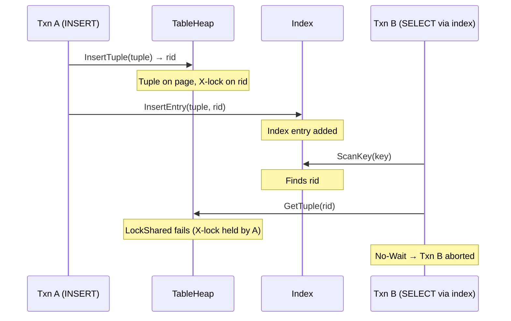
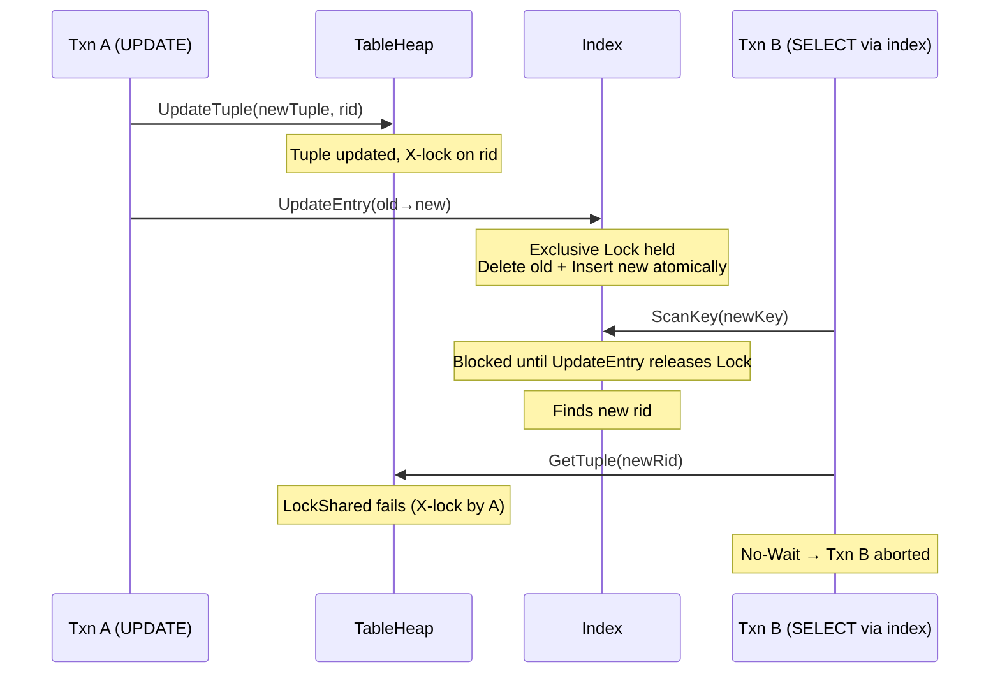
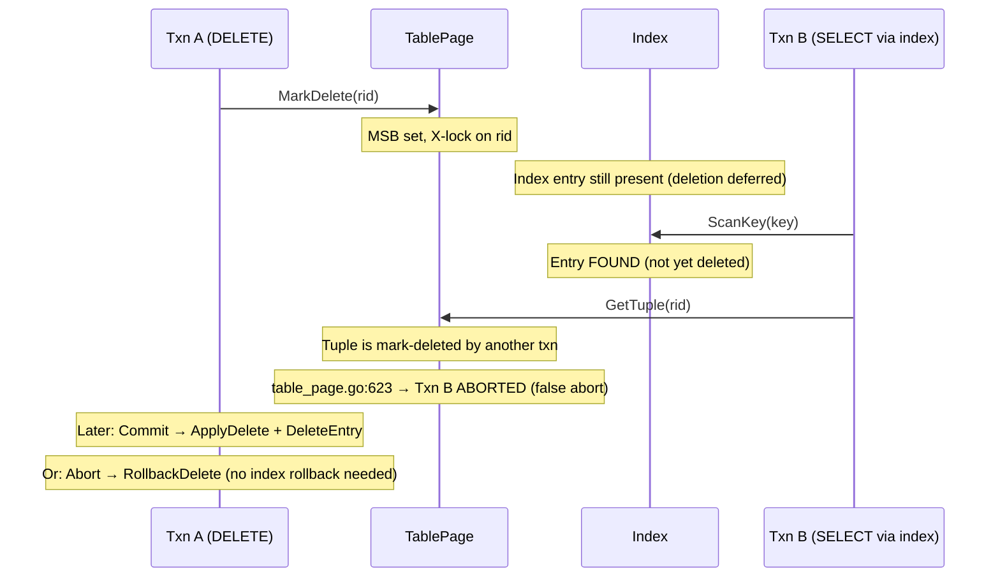

# Tuple/Index Update Consistency

> This is the **critical document** for understanding the dirty-read-at-delete anomaly.

## 1. Overview

SamehadaDB executors perform **two separate steps** for each DML operation:
1. **Tuple mutation** (via `TableHeap`): modifies the physical tuple on a table page.
2. **Index mutation** (via index wrapper): updates the index to reflect the new tuple state.

These two steps are **not atomic** — there is a window between them where the tuple and index are inconsistent. For INSERT and UPDATE, this window is benign. For DELETE, this previously caused a **dirty read anomaly** when concurrent transactions used index scans. This has been fixed by deferring `DeleteEntry` to the commit phase.

## 2. INSERT Timing — Safe

**File:** `lib/execution/executors/insert_executor.go`

```
Step 1 (line 42):  tableHeap.InsertTuple(tuple, txn, oid, false)
                   → tuple physically written to page
                   → exclusive lock acquired on new RID
                   → write record added to txn.writeSet

Step 2 (lines 48-56): for each index:
                       idx.InsertEntry(tuple, rid, txn)
                       → index entry added
```



**Why safe:**
- The tuple is physically present before the index entry is added. If Txn B finds the index entry, the tuple exists.
- Txn B's `GetTuple` attempts `LockShared(rid)`, which fails because Txn A holds an exclusive lock → Txn B is aborted (No-Wait). **No dirty read.**
- In the window between InsertTuple and InsertEntry (tuple exists but index doesn't point to it yet), Txn B simply doesn't find the row via index scan — this is equivalent to Txn B running before Txn A, which is a valid serialization order.

## 3. UPDATE Timing — Mostly Safe

**File:** `lib/execution/executors/update_executor.go`

```
Step 1 (lines 64-67):  tableHeap.UpdateTuple(newTuple, rid, txn, oid)
                        → tuple updated on page (in-place or relocated)
                        → exclusive lock acquired/upgraded on rid
                        → write record added to txn.writeSet

Step 2 (lines 80-102):  for each index:
                         idx.UpdateEntry(oldTuple, oldRID, newTuple, newRID, txn)
                         → exclusive Lock on wrapper mutex
                         → atomic: delete old entry + insert new entry
```



**Why mostly safe:**
- `UpdateEntry` acquires the **exclusive wrapper lock** (`updateMtx.Lock()`), so the delete+insert pair is atomic with respect to scans. No scan can see the intermediate state.
- After `UpdateEntry` releases the lock, a scan will find the new entry. But `GetTuple` on the new RID will fail because Txn A still holds the X-lock → Txn B aborted. **No dirty read.**
- The window between `UpdateTuple` and `UpdateEntry` (tuple updated but index still points to old state) could allow a scan to find the old entry and read the new tuple data. The X-lock on the RID prevents this.

## 4. DELETE Timing — **Fixed (Previously UNSAFE)**

**File:** `lib/execution/executors/delete_executor.go`

```
Step 1 (line 55):  tableMetadata.Table().MarkDelete(rid, oid, txn, false)
                   → MSB set on tuple size (tuple still physically present)
                   → exclusive lock acquired/upgraded on rid
                   → write record added to txn.writeSet

Step 2: Index entry deletion is deferred to commit phase
        (TransactionManager.Commit() calls DeleteEntry after ApplyDelete)
```

> ✅ **Fixed: Index entry deletion deferred to commit phase**
> Previously, `DeleteEntry` was called here during execution, allowing dirty reads via index scan.
> Now, the executor only calls `MarkDelete`. Index entries are removed in `TransactionManager.Commit()` after `ApplyDelete`.
> This ensures the index entry remains visible until the transaction commits, preventing dirty reads.

### Current Behavior (After Fix)

With the fix in place, all concurrent index scan scenarios result in **false aborts** (not dirty reads), consistent with sequential scan behavior:



**What happens:** Txn B always finds the index entry (it was never removed during execution). When Txn B reads the tuple via `GetTuple`, it detects the mark-delete flag from another transaction and is **aborted** (false abort). This is the same behavior as sequential scan — pessimistic but safe. No dirty read occurs.

**Impact:** False aborts reduce throughput but do not violate isolation. The `RequestManager` (`lib/samehada/request_manager.go`) mitigates this by re-queuing aborted queries at the head.

### Historical: Previous Scenarios (Before Fix)

Before the fix, two problematic scenarios existed:

- **Scenario A (false abort):** Index scan obtained the RID before `DeleteEntry` ran, then `GetTuple` detected mark-delete → false abort. This scenario still occurs with the fix (same outcome).
- **Scenario B (dirty read):** Index scan occurred after `DeleteEntry` removed the entry → row invisible via index → uncommitted delete observed. **This scenario is now impossible** because the index entry is never removed during execution.

### Sequential Scan (No Index) — Unchanged

When using a sequential scan (no index), the behavior is unchanged:

1. `GetNextTupleRID` iterates through all slots on each page.
2. For each RID, `GetTuple` is called.
3. `GetTuple` (`table_page.go:611-631`) checks the mark-delete flag:
   - If marked by **same** transaction: returns the tuple (transaction can see its own deletes).
   - If marked by **another** transaction: **aborts the reading transaction** (line 623).

Sequential scans produce **false aborts**, not dirty reads. With the fix, index scans now behave consistently with sequential scans.

## 5. Reproduction Conditions

The dirty read at DELETE (Scenario B) occurs when **all** of the following are true:

1. **Index access path**: The query uses an index scan (not sequential scan).
2. **Concurrent delete**: Another transaction has executed `MarkDelete` + `DeleteEntry` but not yet committed.
3. **Timing**: The scan's `ScanKey` call occurs **after** `DeleteEntry` removes the index entry.
4. **No rollback yet**: The deleting transaction has not aborted (which would re-insert the index entry).

**Affected code paths:**
- `delete_executor.go:55` (`MarkDelete`) and `delete_executor.go:71` (`DeleteEntry`)
- Any executor or scan that uses index-based lookup: `index_join_executor.go`, `selection_executor.go` with index predicate, etc.

## 6. How Commit-Time Index Deletion Fixes This

`DeleteEntry` has been deferred to the commit phase (alongside `ApplyDelete`). The index entry remains present until the transaction commits:

- Txn B's index scan always finds the entry.
- Txn B's `GetTuple` detects the mark-delete flag from another transaction → Txn B aborted (false abort), but **not** a dirty read.
- If Txn A aborts, the entry was never removed from the index — no inconsistency, and no index rollback needed.

The trade-off: keeping index entries until commit increases the chance of false aborts, but eliminates dirty reads entirely.

## 7. Summary Table

| Operation | Tuple Step | Index Step | Window Risk | Dirty Read? |
|---|---|---|---|---|
| **INSERT** | `InsertTuple` (line 42) | `InsertEntry` (line 54) | Row invisible via index before InsertEntry | No — valid serialization |
| **DELETE** | `MarkDelete` (line 55) | `DeleteEntry` (deferred to commit) | Entry remains until commit | No — fixed |
| **UPDATE** | `UpdateTuple` (line 64) | `UpdateEntry` (line 90) | Atomic under exclusive lock | No — X-lock prevents read |

## 8. Cross-References

- **LockManager No-Wait behavior**: [01_lock_manager.md](01_lock_manager.md)
- **Page latch patterns in TableHeap**: [02_page_latch_and_pinning.md](02_page_latch_and_pinning.md)
- **Index latch protocols**: [03_index_concurrency.md](03_index_concurrency.md)
- **UPDATE RID change mechanics**: [05_update_rollback_rid.md](05_update_rollback_rid.md)
- **Rollback restoring index entries**: [06_rollback_handling.md](06_rollback_handling.md)
- **Isolation guarantee analysis**: [07_isolation_guarantees.md](07_isolation_guarantees.md)
- **Transaction and recovery overview**: [../overview/05_transaction_recovery.md](../overview/05_transaction_recovery.md)
