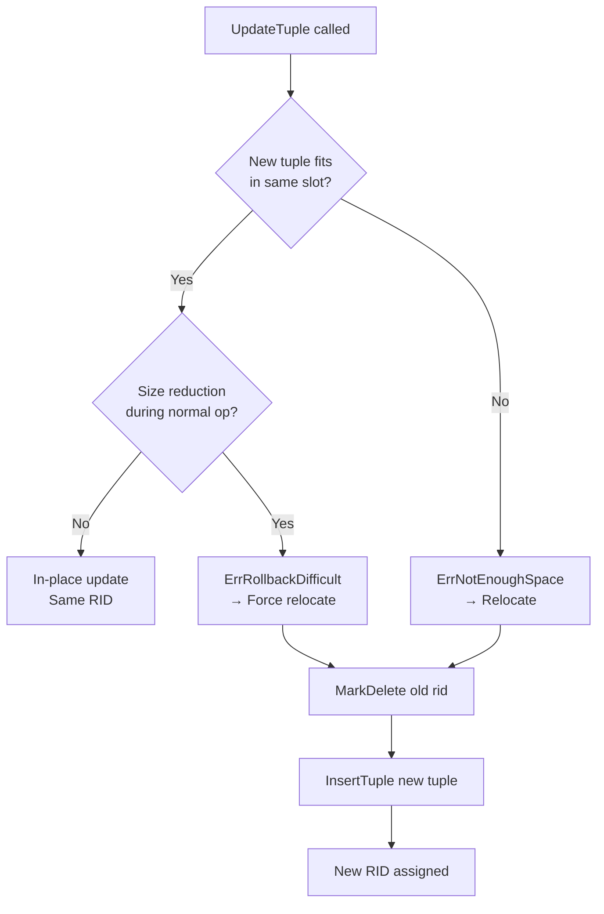

# UPDATE and RID Change Mechanics

## 1. Overview

When a tuple is updated in SamehadaDB, the system first attempts an **in-place update** on the same page. If the new tuple doesn't fit (it's larger than the old one), the system falls back to a **relocate update**: mark-delete the old tuple and insert a new one on a different page. This changes the tuple's RID, which has cascading effects on index entries and rollback handling.

## 2. Update Decision Tree



## 3. In-Place Update

**Code:** `table_page.go:UpdateTuple` (lines 148-264)

When the new tuple fits in the existing slot:
1. Acquire X-lock or upgrade S→X lock (lines 166-177)
2. Copy old tuple data for WAL logging
3. Overwrite slot data with new tuple
4. Return success with `needFollowTuple = nil` (indicating no relocation)

**Constraint — ErrRollbackDifficult** (`table_page.go:233-236`):

If the new tuple is **smaller** than the old tuple during a normal (non-rollback) update, `UpdateTuple` returns `ErrRollbackDifficult`. The reason: if the update were performed in-place with a smaller tuple, a rollback would need to restore the larger original tuple — but the slot may no longer have enough space (the freed space could have been reclaimed).

This forces a relocate update even when the new tuple technically fits, ensuring rollback safety.

> **Note:** When `isRollbackOrUndo` is `true` (called during abort or recovery), `ErrRollbackDifficult` is not raised — the system allows size reduction because rollback is the final state.

## 4. Relocate Update

**Code:** `table_heap.go:UpdateTuple` (lines 143-227)

When `TablePage.UpdateTuple` returns `ErrNotEnoughSpace` or `ErrRollbackDifficult`:

```
Line 192: pg.MarkDelete(rid, txn, ...)         → Mark old tuple as deleted
Line 197: rid2, err = t.InsertTuple(tpl, ...)  → Insert new tuple on any page with space
Line 202: newRID = rid2                        → New RID assigned
```

The `TableHeap.UpdateTuple` method handles the fallback:

1. **Line 192**: Call `TablePage.MarkDelete(rid)` on the original page (WLatch already held)
2. **Line 174**: Release WLatch on original page
3. **Line 197**: Call `TableHeap.InsertTuple(newTuple)` — this finds a page with space, acquires WLatch, inserts
4. **Line 202**: Capture `newRID` from the insert

The result is two physical changes: the old RID is mark-deleted, the new RID contains the updated data.

## 5. WriteRecord Semantics for UPDATE

The write record captures enough information to rollback both in-place and relocated updates:

```go
// transaction.go:47-57
type WriteRecord struct {
    rid1   *page.RID      // Original RID
    rid2   *page.RID      // Destination RID (same as rid1 for in-place)
    wtype  WType           // UPDATE (2)
    tuple1 *tuple.Tuple    // Old tuple data (before update)
    tuple2 *tuple.Tuple    // New tuple data (after update)
    table  *TableHeap
    oid    uint32
}
```

| Field | In-Place Update | Relocated Update |
|---|---|---|
| `rid1` | Original RID | Original RID (mark-deleted) |
| `rid2` | Same as `rid1` | **New RID** (on different page) |
| `tuple1` | Old tuple data | Old tuple data |
| `tuple2` | New tuple data | New tuple data |

**How to detect relocation:** `rid1 != rid2` (checked in `transaction_manager.go:211`).

**Write record creation:**

- In-place: `table_heap.go:216-218` — `NewWriteRecord(rid, rid, UPDATE, oldTuple, newTuple, ...)`
- Relocated: `table_heap.go:220-222` — `NewWriteRecord(rid, newRID, UPDATE, oldTuple, newTuple, ...)`

## 6. Index Propagation for RID Changes

**Code:** `update_executor.go:80-102`

After `TableHeap.UpdateTuple` returns, the executor updates each index:

```go
// update_executor.go
if newRID != nil {
    // Relocated: RID changed
    idx.UpdateEntry(oldTuple, oldRID, newTuple, *newRID, txn)  // line 90/96
} else {
    // In-place: same RID
    idx.UpdateEntry(oldTuple, rid, newTuple, rid, txn)          // line 92
}
```

`UpdateEntry` acquires the **exclusive wrapper lock** and atomically:
1. Deletes the old index entry (keyed by old tuple values + old RID)
2. Inserts the new index entry (keyed by new tuple values + new/same RID)

This ensures the index always points to a valid RID, even when the tuple relocates.

## 7. Rollback of Relocated Update

**Code:** `transaction_manager.go:205-256` (Abort method)

When aborting a relocated update (`rid1 != rid2`):

```
Line 215-220: Fetch page containing rid2 → WLatch → ApplyDelete(rid2) → WUnlatch
              → Physically remove the newly inserted tuple

Line 223:     table.RollbackDelete(rid1, txn)
              → Unset mark-delete on original tuple → Original tuple visible again

Lines 241-254: For each index needing rollback:
               idx.UpdateEntry(tuple2, rid2, tuple1, rid1, txn)
               → Atomic: delete new entry + re-insert old entry
```

**Rollback of in-place update** (`rid1 == rid2`, lines 224-238):

```
Line 232:     tpage.UpdateTuple(tuple1, ..., isRollbackOrUndo=true)
              → Overwrite with original tuple data (size reduction allowed)

Lines 241-254: For each index needing rollback:
               idx.UpdateEntry(tuple2, rid2, tuple1, rid1, txn)
               → Re-key index entries to original values
```

## 8. Edge Cases

### Size Reduction Paradox

`ErrRollbackDifficult` prevents in-place size reduction during normal updates. But during rollback (with `isRollbackOrUndo=true`), size reduction is allowed because:
- Rollback restores the original (larger) tuple to its original slot.
- The original slot had enough space for the original tuple (it was there before the update).
- Actually, during rollback of a relocated update, `RollbackDelete(rid1)` restores the original slot, so the tuple data is already there.

### Multi-Column Index Considerations

When a tuple relocates, **all** indexes must be updated — even if the indexed columns didn't change. The RID itself changed, so the index entry must point to the new RID. This is handled in `update_executor.go:80-102` where the loop iterates over all indexes.

## 9. Cross-References

- **Page latch patterns during UpdateTuple**: [02_page_latch_and_pinning.md](02_page_latch_and_pinning.md)
- **Index UpdateEntry atomicity**: [03_index_concurrency.md](03_index_concurrency.md)
- **Tuple/index consistency during UPDATE**: [04_tuple_index_consistency.md](04_tuple_index_consistency.md)
- **Full rollback flow**: [06_rollback_handling.md](06_rollback_handling.md)
- **Transaction and recovery overview**: [../overview/05_transaction_recovery.md](../overview/05_transaction_recovery.md)
