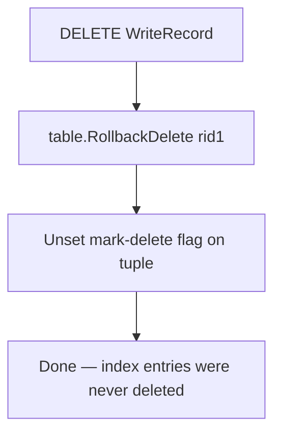
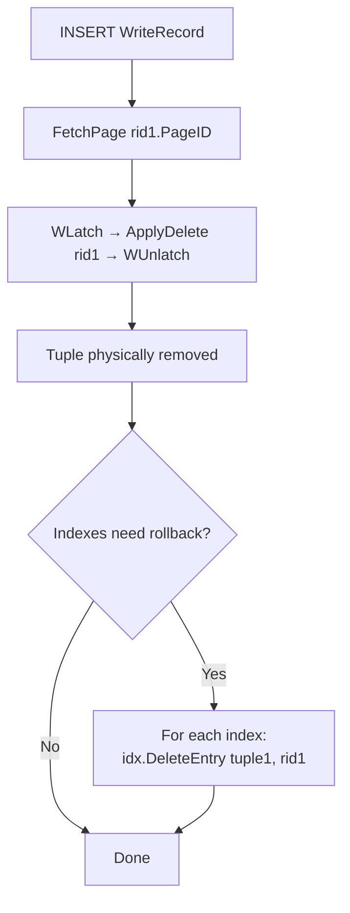
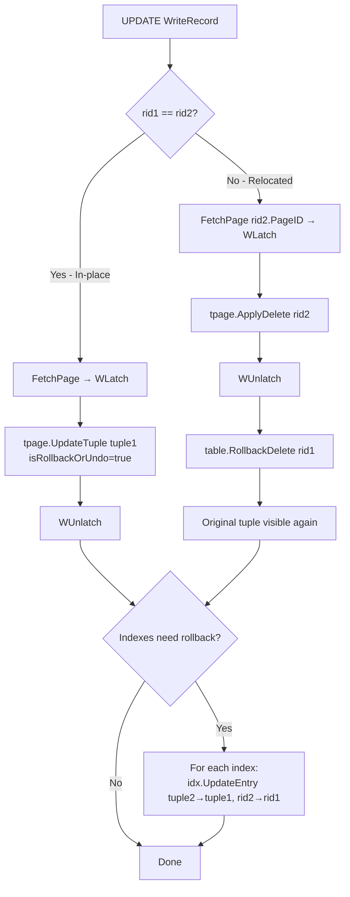

# Rollback Processing Flows

## 1. Overview

SamehadaDB has two distinct rollback paths:

| Path | Trigger | Table Restored | Index Restored |
|---|---|---|---|
| **Normal Abort** | `TransactionManager.Abort()` | Yes | Yes |
| **Crash Recovery Undo** | `LogRecovery.Undo()` | Yes | **No** (requires full rebuild) |

This document details both paths operation by operation.

## 2. Normal Abort — TransactionManager.Abort()

**File:** `lib/storage/access/transaction_manager.go` (lines 133-273)

### Processing Order

The write set is processed in **LIFO (reverse) order** — the most recent write is rolled back first:

```go
for len(writeSet) != 0 {
    item := writeSet[len(writeSet)-1]    // Pop from end
    // ... process item based on wtype
    writeSet = writeSet[:len(writeSet)-1] // Remove last
}
```

LIFO ordering is critical: if a transaction inserted a tuple and then updated it, the update must be rolled back before the insert.

### DELETE Rollback



**Code** (lines 177-184):

| Step | Line | Operation |
|---|---|---|
| 1 | 179 | `table.RollbackDelete(item.rid1, txn)` — unset MSB on tuple size, tuple visible again |

Index entries were never removed (deletion is deferred to commit), so no index rollback is needed for DELETE.

**Effect:** Restores the row to its pre-delete state. Index entries were never modified, so they remain correct.

### INSERT Rollback



**Code** (lines 182-204):

| Step | Line | Operation |
|---|---|---|
| 1 | 188-194 | `FetchPage` → `WLatch` → `tpage.ApplyDelete(item.rid1, ...)` → `UnpinPage` → `WUnlatch` |
| 2 | 201 | For each index: `idx.DeleteEntry(item.tuple1, *item.rid1, txn)` — remove index entry |

**Effect:** Physically removes the inserted tuple and its index entries. The slot is reclaimed.

### UPDATE Rollback



**Code** (lines 205-256):

#### Relocated Update (`rid1 != rid2`, lines 211-223):

| Step | Line | Operation |
|---|---|---|
| 1 | 215-220 | `FetchPage(rid2)` → `WLatch` → `ApplyDelete(rid2)` → `UnpinPage` → `WUnlatch` — remove new tuple |
| 2 | 223 | `table.RollbackDelete(rid1, txn)` — restore original tuple visibility |

#### In-Place Update (`rid1 == rid2`, lines 224-238):

| Step | Line | Operation |
|---|---|---|
| 1 | 227-237 | `FetchPage(rid1)` → `WLatch` → `UpdateTuple(tuple1, isRollbackOrUndo=true)` → `UnpinPage` → `WUnlatch` — overwrite with old data |

#### Index Rollback (both cases, lines 241-254):

| Step | Line | Operation |
|---|---|---|
| 1 | 251 | `idx.UpdateEntry(item.tuple2, *item.rid2, item.tuple1, *item.rid1, txn)` — re-key index entries |

**Effect:** Restores tuple data and index entries to pre-update state. For relocated updates, the new tuple is physically removed and the original is unmarked.

### Lock Release

After all write records are processed:

| Step | Line | Operation |
|---|---|---|
| Release exclusive locks | 259-263 | `lockManager.Unlock(txn, exclusiveLockSet)` |
| Release shared locks | 264-267 | `lockManager.Unlock(txn, sharedLockSet)` |
| Set state | 269 | `txn.SetState(ABORTED)` |
| Release global latch | 272 | `globalTxnLatch.RUnlock()` |

## 3. Crash Recovery Undo — LogRecovery.Undo()

**File:** `lib/recovery/log_recovery/log_recovery.go` (lines 226-281)

### Key Difference from Normal Abort

> ⚠️ **Known Issue: Crash Recovery Does Not Restore Indexes**
> `LogRecovery.Undo()` only replays table-level operations from the WAL. It does **not** update any index entries. After a non-graceful shutdown, all indexes must be fully rebuilt.

### Per-Log-Record Undo Operations

| Log Record Type | Line | Undo Operation | Index? |
|---|---|---|---|
| **INSERT** | 243 | `pg.ApplyDelete(&logRecord.InsertRID, txn, ...)` — physically remove tuple | No |
| **APPLYDELETE** | 250 | `pg.InsertTuple(&logRecord.DeleteTuple, ...)` — re-insert tuple | No |
| **MARKDELETE** | 256 | `pg.RollbackDelete(&logRecord.DeleteRID, txn, ...)` — unset mark | No |
| **ROLLBACKDELETE** | 262 | `pg.MarkDelete(&logRecord.DeleteRID, txn, ...)` — re-mark | No |
| **UPDATE** | 268 | `pg.UpdateTuple(&logRecord.OldTuple, ..., isRollbackOrUndo=true)` — restore old data | No |

### Why No Index Restoration

The WAL log records contain only tuple-level information (RID, tuple data). They do not record index operations. The recovery process:
1. Has no knowledge of which indexes exist for which tables.
2. Cannot reconstruct index keys from tuple data without schema information.
3. Would need to handle all index types and their internal state.

Instead, SamehadaDB takes a simpler approach: rebuild all indexes from scratch after recovery.

### Index Rebuild After Recovery

**File:** `lib/samehada/samehada.go`

The `NewSamehadaDB()` function (line 165) checks for non-graceful shutdown and calls `reconstructIndexDataOfATbl()` (lines 48-109):

1. **Lines 56-89**: For hash indexes: clear old page data.
2. **Lines 92-108**: Sequential scan all tuples in the table.
3. **Lines 103-106**: For each tuple: `idx.InsertEntry(tuple, rid, txn)` — rebuild from scratch.

## 4. Comparison: Normal Abort vs Crash Recovery

| Aspect | Normal Abort | Crash Recovery Undo |
|---|---|---|
| **Source** | `txn.writeSet` (in-memory) | WAL log records (on disk) |
| **Processing order** | LIFO (reverse write set) | Reverse LSN order |
| **Table restoration** | Yes | Yes |
| **Index restoration** | Yes (per-entry rollback) | **No** (full rebuild required) |
| **Lock handling** | Releases all locks after rollback | Recovery phase — no locks acquired |
| **Page latching** | Acquires WLatch per page | Acquires WLatch per page |
| **Concurrent access** | Other transactions may be running | Single-threaded recovery |

## 5. Rollback and the Dirty-Read Fix

With the fix in place, `DeleteEntry` is deferred to the commit phase. During abort of a DELETE:

1. `RollbackDelete(rid1)` — tuple becomes visible again.
2. No index rollback needed — index entries were never deleted.

Since index entries remain present throughout the transaction's lifetime, concurrent transactions always find the entry via index scan. They may encounter a false abort (mark-delete detected by `GetTuple`), but **dirty reads no longer occur**.

See [04_tuple_index_consistency.md](04_tuple_index_consistency.md) for the full analysis.

## 6. Cross-References

- **LockManager unlock**: [01_lock_manager.md](01_lock_manager.md) §7
- **Page WLatch during ApplyDelete**: [02_page_latch_and_pinning.md](02_page_latch_and_pinning.md) §5
- **Index entry restoration**: [03_index_concurrency.md](03_index_concurrency.md)
- **Dirty-read-at-delete root cause**: [04_tuple_index_consistency.md](04_tuple_index_consistency.md)
- **UPDATE RID change and rollback**: [05_update_rollback_rid.md](05_update_rollback_rid.md) §7
- **Isolation implications**: [07_isolation_guarantees.md](07_isolation_guarantees.md)
- **WAL and recovery fundamentals**: [../overview/05_transaction_recovery.md](../overview/05_transaction_recovery.md)
