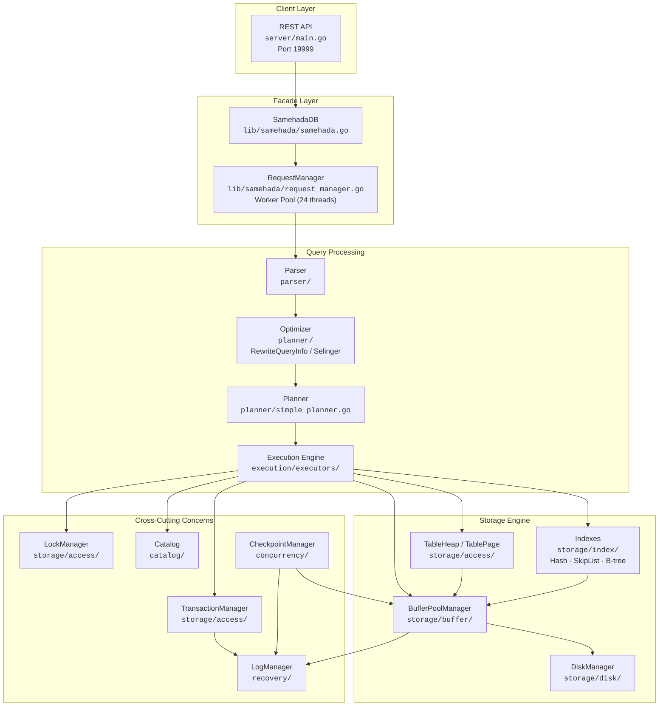
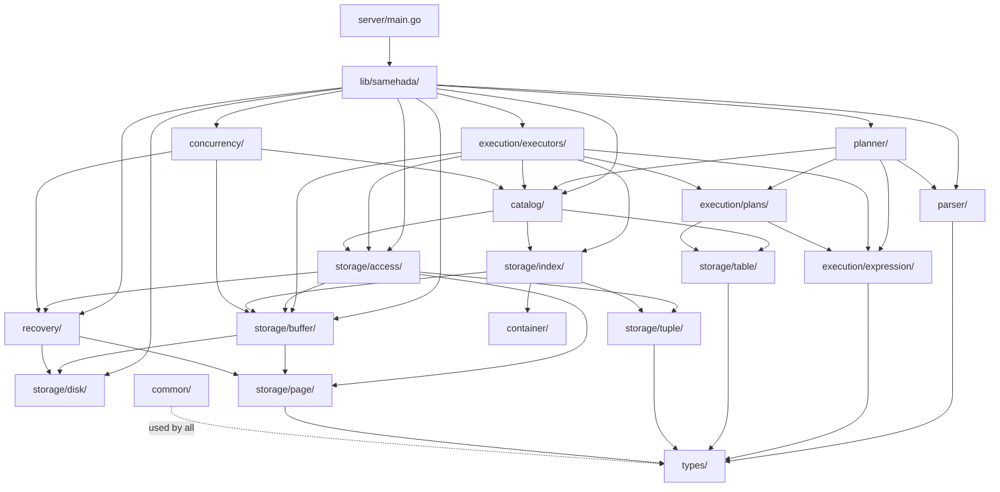

# SamehadaDB System Architecture

## 1. Overview

SamehadaDB is an educational relational database management system written in Go, derived from CMU's [BusTub](https://github.com/cmu-db/bustub) project. It implements a full RDBMS stack from SQL parsing through disk storage, including buffer pool management, multiple index types, ACID transactions with write-ahead logging, and a cost-based query optimizer.

The system exposes a REST API (`server/main.go`, port 19999) and can also be embedded directly via the `SamehadaDB` struct in `lib/samehada/samehada.go`. All SQL execution flows through a single entry point -- `ExecuteSQLRetValues` -- which orchestrates parsing, optimization, planning, and execution within a transaction.

Key design points:

- **Page-oriented storage** with a 4096-byte page size and clock-sweep buffer pool replacement.
- **Write-ahead logging** with ARIES-style redo/undo recovery.
- **Strict two-phase locking** for concurrency control with deadlock detection via abort-and-retry.
- **Three index types**: extendible hash, skip list (concurrent), and B-tree (partial).
- **Volcano-style executor model** with `Init()` / `Next()` iterator interface.
- **Selinger-style cost-based optimizer** using catalog statistics.

---

## 2. System Layer Diagram



---

## 3. Component Responsibilities

### `common/` -- Constants and Configuration
Defines system-wide constants (`PageSize = 4096`, `MaxTxnThreadNum = 24`), invalid sentinel values, the `EnableOnMemStorage` toggle, and shared utilities like `ReaderWriterLatch`. See `lib/common/config.go` for the full configuration surface.

### `types/` -- Scalar Type System
Provides the core scalar types used throughout the system: `TxnID`, `PageID`, `LSN`, `TypeID`, and the polymorphic `Value` type that wraps Go primitives with type metadata for serialization.
See [06_catalog_types.md](06_catalog_types.md).

### `storage/disk/` -- Disk Management
Abstracts file I/O behind a `DiskManager` interface with two implementations: a real file-backed manager and an in-memory manager (controlled by `EnableOnMemStorage`). Handles page-level reads and writes at fixed 4096-byte offsets.
See [03_buffer_storage.md](03_buffer_storage.md).

### `storage/page/` -- Page Types
Defines the on-disk page layout. Includes the base `Page` type (header + data), `TablePage` (slotted-page format for tuples), and `HeaderPage` (catalog bootstrap). Each page carries a `PageID` and `LSN` for recovery.
See [03_buffer_storage.md](03_buffer_storage.md).

### `storage/buffer/` -- Buffer Pool Manager
Manages a fixed-size pool of in-memory page frames. Uses a **clock-sweep replacement policy** (`ClockReplacer`). Provides `FetchPage`, `NewPage`, `UnpinPage`, and `FlushPage` operations. All page access in the system goes through the buffer pool.
See [03_buffer_storage.md](03_buffer_storage.md).

### `storage/tuple/` -- Tuple Representation
Defines `Tuple` (serialized row data + RID) and `RID` (PageID + SlotNumber) used to address individual rows within a table heap.
See [03_buffer_storage.md](03_buffer_storage.md).

### `storage/table/` -- Schema and Column
`Schema` defines a table's column list; `Column` describes a single column's name, type, offset, and constraints. Used by the catalog, executor, and planner layers.
See [06_catalog_types.md](06_catalog_types.md).

### `storage/access/` -- Table Heap, Transactions, and Locking
Contains `TableHeap` (linked-list of `TablePage`s for row storage), `TablePageIterator`, `Transaction`, `TransactionManager`, and `LockManager`. The lock manager implements strict 2PL with tuple-level shared/exclusive locks.
See [03_buffer_storage.md](03_buffer_storage.md) and [05_transaction_recovery.md](05_transaction_recovery.md).

### `storage/index/` -- Index Implementations
Three index types, all implementing a common `Index` interface:
- **ExtendibleHashTableIndex** -- directory-based hash index.
- **SkipListIndex** -- concurrent lock-free skip list; the primary production index.
- **BTreeIndex** -- B-tree (partial implementation).

See [04_index.md](04_index.md).

### `catalog/` -- System Catalog
`Catalog` maps table names/OIDs to `TableMetadata` (schema, table heap, indexes). Also holds `Statistics` per table (row count, distinct value estimates) used by the optimizer.
See [06_catalog_types.md](06_catalog_types.md).

### `execution/plans/` -- Plan Nodes
Typed plan tree nodes: `SeqScanPlanNode`, `IndexScanPlanNode`, `InsertPlanNode`, `DeletePlanNode`, `UpdatePlanNode`, `HashJoinPlanNode`, `OrderByPlanNode`, `LimitPlanNode`, `AggregationPlanNode`, `SelectionPlanNode`, etc.
See [02_execution_engine.md](02_execution_engine.md).

### `execution/executors/` -- Executor Implementations
Volcano-style `Init()` / `Next()` iterators, one per plan node type. `ExecutionEngine` is the top-level driver that calls `Init()` then loops `Next()` to drain results.
See [02_execution_engine.md](02_execution_engine.md).

### `execution/expression/` -- Expression Evaluation
Expression tree nodes for column references, constants, comparisons, and arithmetic. Used in predicates, projections, and join conditions.
See [02_execution_engine.md](02_execution_engine.md).

### `parser/` -- SQL Parser
Wraps a third-party SQL parser to produce `QueryInfo` structs consumed by the planner. Handles SELECT, INSERT, UPDATE, DELETE, CREATE TABLE, and CREATE INDEX statements.
See [01_parser_planner.md](01_parser_planner.md).

### `planner/` -- Query Planner and Optimizer
`SimplePlanner` converts parsed `QueryInfo` into a plan tree. `RewriteQueryInfo` performs rule-based rewrites (predicate pushdown). A `SelingerOptimizer` enumerates join orderings using dynamic programming and catalog statistics.
See [01_parser_planner.md](01_parser_planner.md).

### `recovery/` -- Write-Ahead Logging and Recovery
`LogManager` appends log records to a WAL file with group commit. Log record types cover Begin, Commit, Abort, Insert, Delete, Update, NewPage, and GracefulShutdown. Recovery runs ARIES redo then undo passes.
See [05_transaction_recovery.md](05_transaction_recovery.md).

### `concurrency/` -- Background Threads
`CheckpointManager` periodically flushes dirty pages and writes checkpoint records. `StatisticsUpdater` refreshes catalog statistics in the background.
See [05_transaction_recovery.md](05_transaction_recovery.md).

### `materialization/` -- Temporary Storage
`TmpTuple` provides temporary tuple storage used during sorting and aggregation within executors.

### `container/` -- Data Structure Containers
Reusable concurrent data structures: `HashTable` (extendible hashing) and `SkipList` (lock-free). Used as the backing stores for the corresponding index types.
See [04_index.md](04_index.md).

---

## 4. Package Dependency Graph



---

## 5. Request Lifecycle

A SQL query flows through `ExecuteSQLRetValues` in `lib/samehada/samehada.go`:

```
Client Request
  │
  ▼
┌──────────────────────────────────────────────────────────────────┐
│ 1. PARSE        parser.ProcessSQLStr(sqlStr)                     │
│                 → QueryInfo (AST + metadata)                     │
├──────────────────────────────────────────────────────────────────┤
│ 2. OPTIMIZE     RewriteQueryInfo(queryInfo, catalog)             │
│                 → Predicate pushdown, index selection             │
│                 → Selinger join ordering (if multi-table)         │
├──────────────────────────────────────────────────────────────────┤
│ 3. BEGIN TXN    txnMgr.Begin(nil)                                │
│                 → Allocates TxnID, creates Transaction object    │
├──────────────────────────────────────────────────────────────────┤
│ 4. PLAN         MakePlan(queryInfo, catalog, bpm, txn)           │
│                 → Builds plan node tree                          │
├──────────────────────────────────────────────────────────────────┤
│ 5. EXECUTE      execEngine.Execute(plan, txn)                    │
│                 → Init() then Next() loop                        │
│                 → Returns []Tuple or nil (on abort)              │
├──────────────────────────────────────────────────────────────────┤
│ 6. COMMIT/ABORT if txn.GetState() == ABORTED → Abort(txn)       │
│                 else → Commit(txn)                               │
│                 → WAL flush, lock release                        │
├──────────────────────────────────────────────────────────────────┤
│ 7. CONVERT      Tuples → [][]interface{} for client              │
└──────────────────────────────────────────────────────────────────┘
```

When accessed through the **RequestManager** (`lib/samehada/request_manager.go`), the flow gains concurrency:
- `AppendRequest` enqueues the SQL string with a result channel.
- The `Run` loop dequeues requests and spawns `ExecuteSQLForTxnTh` goroutines (up to `MaxTxnThreadNum = 24`).
- If a transaction aborts due to lock contention (`QueryAbortedErr`), the request is **re-enqueued at the head** of the queue for automatic retry.
- The client goroutine blocks on its channel until the result arrives.

---

## 6. Initialization Sequence

`NewSamehadaDB(dbName, memKBytes)` in `lib/samehada/samehada.go`:

```
1. Check if database file already exists on disk
2. Create SamehadaInstance:
   ├── DiskManager (file or in-memory)
   ├── LogManager
   ├── BufferPoolManager (memKBytes / PageSize frames)
   ├── LockManager
   ├── TransactionManager
   └── CheckpointManager

3. IF existing database:
   │  a. Run REDO pass (replay WAL from beginning)
   │  b. Run UNDO pass (rollback uncommitted txns)
   │  c. IF last log record ≠ GracefulShutdown:
   │     └── Reconstruct all indexes from table heap data
   │  d. Bootstrap catalog from existing pages
   │
   ELSE (new database):
      └── Bootstrap fresh catalog (create system tables)

4. Create ExecutionEngine
5. Create StatisticsUpdater → start background goroutine
6. Create RequestManager → start Run loop goroutine
7. Return SamehadaDB ready to accept queries
```

The recovery check for `GracefulShutdown` is critical: if the previous shutdown was unclean, indexes may be inconsistent and must be rebuilt by scanning the table heaps.

---

## 7. Shutdown Sequence

`Shutdown()` in `lib/samehada/samehada.go`:

```
1. Stop background threads (StatisticsUpdater, RequestManager)
2. Finalize all indexes (flush dirty index pages)
3. Write GracefulShutdown log record to WAL
4. Flush WAL to disk
5. Flush all dirty buffer pool pages
6. Close disk manager file handles
```

The `GracefulShutdown` log record is what allows the next startup to skip index reconstruction.

---

## 8. Configuration

Key configuration constants in `lib/common/config.go`:

| Constant | Value | Description |
|----------|-------|-------------|
| `PageSize` | 4096 | Fixed page size in bytes for all pages |
| `EnableOnMemStorage` | `true` | Use in-memory storage (no disk I/O); set `false` for persistence |
| `KernelThreadNum` | 24 | Number of goroutines for internal operations |
| `MaxTxnThreadNum` | 24 | Max concurrent transaction worker goroutines in RequestManager |
| `BufferPoolMaxFrameNumForTesting` | varies | Buffer pool size override for tests |

Buffer pool size is normally computed as `memKBytes * 1024 / PageSize` at startup.

Invalid sentinel values (`InvalidPageID`, `InvalidTxnID`, `InvalidLSN`, etc.) are defined in the same file and used throughout the codebase for null/unset checks.

---

## 9. Error and Abort Propagation Flow

SamehadaDB uses an abort-and-retry model for handling lock contention and deadlocks:

```
LockManager.LockExclusive() / LockShared()
  │ fails (would cause deadlock or timeout)
  ▼
Executor sets txn.SetState(ABORTED)
  │
  ▼
ExecutionEngine.Execute() detects ABORTED → returns nil
  │
  ▼
ExecuteSQLRetValues() checks txn state
  │ txn.GetState() == ABORTED
  ▼
TransactionManager.Abort(txn)
  │ undo all changes via WAL
  ▼
Returns QueryAbortedErr to caller
  │
  ▼
RequestManager re-enqueues request at HEAD of queue
  │
  ▼
Request is retried with a new transaction
```

This ensures that transient lock conflicts do not surface as errors to the client. The request is transparently retried until it succeeds.

---

## 10. Cross-References

| Document | Topic |
|----------|-------|
| [01_parser_planner.md](01_parser_planner.md) | SQL parsing, QueryInfo structure, SimplePlanner, RewriteQueryInfo, Selinger optimizer |
| [02_execution_engine.md](02_execution_engine.md) | Volcano executor model, plan nodes, expression evaluation, ExecutionEngine |
| [03_buffer_storage.md](03_buffer_storage.md) | DiskManager, BufferPoolManager, ClockReplacer, page layout, TableHeap, tuple format |
| [04_index.md](04_index.md) | ExtendibleHashTable, SkipList, B-tree indexes, Index interface, container implementations |
| [05_transaction_recovery.md](05_transaction_recovery.md) | Transaction lifecycle, LockManager, 2PL, WAL, log records, ARIES recovery, CheckpointManager |
| [06_catalog_types.md](06_catalog_types.md) | Catalog structure, TableMetadata, Schema/Column, type system, Statistics |

### Key Source Files

| File | Role |
|------|------|
| `lib/samehada/samehada.go` | Top-level facade: `SamehadaDB`, `NewSamehadaDB`, `ExecuteSQLRetValues`, `Shutdown` |
| `lib/samehada/samehada_instance.go` | `SamehadaInstance` -- aggregates all storage/transaction managers |
| `lib/samehada/request_manager.go` | `RequestManager` -- concurrent request queue with abort-retry |
| `lib/common/config.go` | System-wide constants and configuration |
| `server/main.go` | REST API server (JSON and MessagePack endpoints) |
