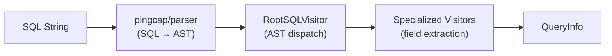
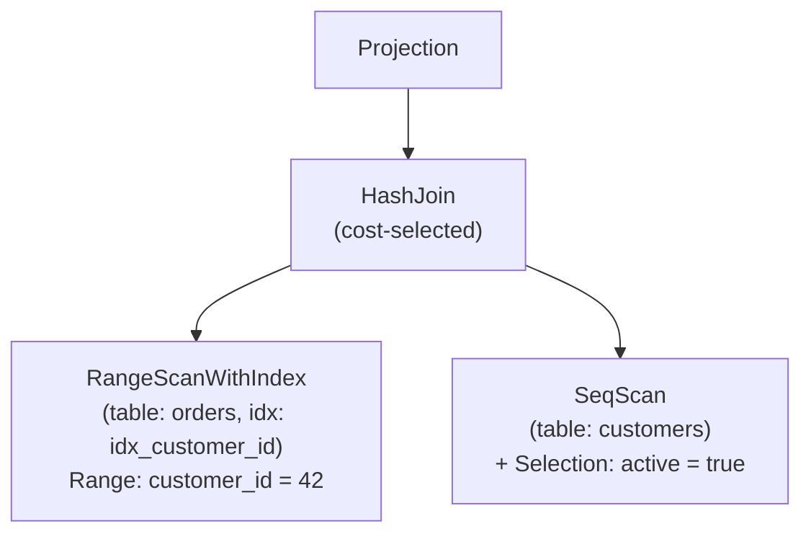

# Parser and Query Planner

## 1. Overview

SamehadaDB processes SQL queries through a three-stage front-end pipeline: **parsing**, **planning**, and **optimization**. The parser transforms raw SQL strings into a structured `QueryInfo` representation using PingCAP's parser library and a visitor pattern over the resulting AST. The planner then converts `QueryInfo` into an executable plan tree composed of plan nodes. An optional Selinger-style optimizer selects index scans and join orderings based on cost estimation.

Key source locations:

| Component | Path |
|---|---|
| Parser | `lib/parser/parser.go` |
| Visitors | `lib/parser/*_visitor.go` |
| QueryInfo | `lib/parser/parser.go` (struct definition) |
| SimplePlanner | `lib/planner/simple_planner.go` |
| Selinger Optimizer | `lib/planner/optimizer/selinger_optimizer.go` |
| Plan Nodes | `lib/execution/plans/` |

## 2. Parsing Pipeline

The parsing pipeline transforms a raw SQL string into a `QueryInfo` struct through four stages:

### Stage Details

1. **Lexing and Parsing**: `ProcessSQLStr(sqlStr)` calls the PingCAP parser (`github.com/pingcap/parser`) to produce a standard SQL AST. This handles all SQL grammar recognition, tokenization, and syntax validation.

2. **AST Dispatch**: `extractInfoFromAST` creates a `RootSQLVisitor` and calls `Accept` on the AST root. The root visitor inspects the top-level AST node type (SELECT, INSERT, CREATE TABLE, DELETE, UPDATE) and delegates to the appropriate specialized visitor(s).

3. **Field Extraction**: Specialized visitors walk their respective AST subtrees to populate fields on the `QueryInfo` struct -- columns, predicates, join conditions, aggregates, and so on.

4. **QueryInfo Assembly**: The fully populated `QueryInfo` struct is returned to the caller, ready for the planner.

Entry point: `lib/parser/parser.go` -- `ProcessSQLStr(sqlStr string) (*QueryInfo, error)`

## 3. QueryInfo Structure

`QueryInfo` (defined in `lib/parser/parser.go`, lines 11-26) is the intermediate representation between parsing and planning. It captures all information needed to build a plan tree.

| Field | Type | Description |
|---|---|---|
| `QueryType` | enum | One of: `SELECT`, `CreateTable`, `INSERT`, `DELETE`, `UPDATE` |
| `SelectFields` | `[]*SelectFieldExpression` | Selected columns; each has `IsAgg`, `AggType`, `TableName`, `ColName` |
| `SetExpressions` | `[]*SetExpression` | UPDATE SET clause column=value pairs |
| `NewTable` | `*string` | Table name for CREATE TABLE |
| `ColDefExpressions` | slice | Column definitions for CREATE TABLE |
| `IndexDefExpressions` | slice | Index definitions for CREATE TABLE |
| `TargetCols` | `[]*string` | Target column names for INSERT |
| `Values` | `[]*types.Value` | Values for INSERT |
| `OnExpressions` | `*BinaryOpExpression` | JOIN ON condition tree |
| `JoinTables_` | `[]*string` | Tables involved in JOINs |
| `WhereExpression` | `*BinaryOpExpression` | WHERE predicate tree |
| `LimitNum` | `int32` | LIMIT value (-1 if absent) |
| `OffsetNum` | `int32` | OFFSET value (-1 if absent) |
| `OrderByExpressions` | `[]*OrderByExpression` | ORDER BY columns and directions |

### BinaryOpExpression Tree

The `WhereExpression` and `OnExpressions` fields use a recursive `BinaryOpExpression` tree to represent predicate logic:

- **Logical nodes**: `LogicalOperationType` is `AND` or `OR` (value -1 if not a logical node). Left and right children are `*BinaryOpExpression` subtrees.
- **Comparison leaf nodes**: `ComparisonOperationType` is one of `Equal`, `NotEqual`, `GT`, `GTE`, `LT`, `LTE`. Left/right are either a column name (`string`), a constant (`types.Value`), or a nested `*BinaryOpExpression`.

## 4. Visitor Pattern

The parser uses a visitor pattern to walk PingCAP AST nodes and extract information into `QueryInfo`. All visitors are in `lib/parser/`.

| Visitor | File | Responsibility |
|---|---|---|
| `RootSQLVisitor` | `root_sql_visitor.go` | Top-level dispatch. Inspects AST node type and delegates to specialized visitors. |
| `SelectFieldsVisitor` | `select_fields_visitor.go` | Extracts SELECT column list, detects aggregate functions, captures table and column names. |
| `BinaryOpVisitor` | `binary_op_visitor.go` | Recursively builds `BinaryOpExpression` tree from WHERE and ON clauses. Handles nested AND/OR and comparison operators. |
| `JoinVisitor` | `join_visitor.go` | Extracts JOIN table names and delegates ON conditions to `BinaryOpVisitor`. |
| `AssignVisitor` | `assign_visitor.go` | Extracts UPDATE SET assignments as column=value pairs (`SetExpression`). |
| `AggFuncVisitor` | `agg_func_visitor.go` | Extracts arguments inside aggregate function calls (e.g., the column in `SUM(col)`). |

## 5. Query Rewriting

`RewriteQueryInfo` (called between parsing and planning) performs lightweight transformations on the `QueryInfo` struct before plan construction. This step handles normalization tasks such as qualifying column names. Details are intentionally brief here as the rewriting logic is minimal; see the source in `lib/parser/` for the current set of rewrites.

## 6. SimplePlanner

`SimplePlanner` (`lib/planner/simple_planner.go`) converts a `QueryInfo` into a tree of plan nodes. Its main entry point is `MakePlan`, which dispatches by `QueryType`.

### Dispatch by Query Type

| QueryType | Method | Behavior |
|---|---|---|
| `CREATE TABLE` | `MakeCreateTablePlan` | Creates a `Schema` from column/index definitions, registers the table with the catalog. Returns `nil` plan (DDL is executed during planning). |
| `INSERT` | `MakeInsertPlan` | Validates target columns and value types against the catalog schema. Returns an `InsertPlanNode`. |
| `DELETE` | `MakeDeletePlan` | Builds a scan sub-plan (SeqScan with Selection), wraps it in a `DeletePlanNode`. |
| `UPDATE` | `MakeUpdatePlan` | Builds a scan sub-plan, wraps it in an `UpdatePlanNode` with the SET expressions. |
| `SELECT` | see below | Routes to optimized or non-optimized path. |

### SELECT Planning

SELECT planning has two paths:

1. **Non-optimized path** (used when OR predicates are present or the optimizer cannot handle the query):
   - `MakeSelectPlanWithoutJoin`: Single-table query. Creates a `SeqScanPlanNode` with a `SelectionPlanNode` for the WHERE predicate.
   - `MakeSelectPlanWithJoin`: Multi-table query. Manually constructs a `HashJoinPlanNode`.

2. **Optimized path** (Selinger optimizer): Invoked for queries without OR predicates, without wildcards, and without aggregates in the optimized path. See Section 7.

### Predicate Construction

`ConstructPredicate` and `processPredicateTreeNode` convert the `BinaryOpExpression` tree from the parser into the execution engine's `expression.Expression` tree:

- Logical nodes (`AND`/`OR`) become `expression.LogicalOp` nodes.
- Comparison nodes become `expression.Comparison` with `ColumnValue` and `ConstantValue` operands.

Cross-reference: [02_execution_engine.md](02_execution_engine.md) for how plan nodes are executed.

## 7. Selinger Optimizer

The Selinger optimizer (`lib/planner/optimizer/selinger_optimizer.go`) performs cost-based optimization for scan selection and join ordering.

### Scan Selection: `findBestScan`

For each table in the query:

1. Collects all available indexes from the catalog.
2. Walks the WHERE clause to build `Range` structs (min/max bounds) for indexed columns.
3. Generates candidate plans: one `RangeScanWithIndex` per applicable index, plus a `SeqScan` fallback.
4. Selects the candidate with the lowest estimated cost.

`findBestScans` calls `findBestScan` for every table involved in the query.

### Join Ordering: `findBestJoin`

Uses dynamic programming to find the optimal join order:

1. Starts from the set of best single-table scans.
2. Enumerates all pairwise join combinations.
3. For each pair, evaluates three join strategies (both directions where applicable):
   - **HashJoin** (left as build side, right as build side)
   - **IndexJoin**
   - **NestedLoopJoin**
4. Sorts candidates by cost and selects the cheapest.
5. Builds up progressively larger join subtrees until all tables are joined.

### Cost Model

Cost estimation uses two metrics from table statistics:

- `AccessRowCount()`: number of rows the scan must read (I/O cost proxy).
- `EmitRowCount()`: number of rows the scan produces after filtering (selectivity proxy).

### Example: Optimized 2-Table Join Plan Tree

In this example, the optimizer chose an index range scan on `orders` (cheaper than SeqScan due to selective range) and a SeqScan on `customers` (no useful index for the predicate), joined via HashJoin.

### Optimizer Limitations

- **No OR predicate support**: Queries with OR in WHERE fall back to the non-optimized path.
- **No bracket handling**: Complex nested parenthetical expressions may not be optimized.
- **Column names must include table prefix**: e.g., `t.col` not just `col`.
- **No wildcard `*` or aggregates**: Queries using `SELECT *` or aggregate functions use the non-optimized path.

## 8. Plan Node Types Catalog

All plan nodes are defined in `lib/execution/plans/`. There are 14 types:

| # | Plan Node | File | Description |
|---|---|---|---|
| 1 | SeqScan | `seq_scan.go` | Full sequential scan of a table |
| 2 | Selection | `selection.go` | Filters rows by a predicate expression |
| 3 | Projection | `projection.go` | Selects/reorders output columns |
| 4 | Insert | `insert.go` | Inserts rows into a table |
| 5 | Delete | `delete.go` | Deletes rows matching a scan |
| 6 | Update | `update.go` | Updates rows matching a scan with SET values |
| 7 | Limit | `limit.go` | Limits output to N rows |
| 8 | Orderby | `orderby.go` | Sorts output by specified columns |
| 9 | Aggregation | `aggregation.go` | Computes aggregate functions (SUM, COUNT, etc.) |
| 10 | HashJoin | `hash_join.go` | Hash-based equi-join of two inputs |
| 11 | NestedLoopJoin | `nested_loop_join.go` | Nested loop join (fallback for non-equi joins) |
| 12 | IndexJoin | `index_join.go` | Join using an index lookup on the inner table |
| 13 | PointScanWithIndex | `point_scan_with_index.go` | Index point lookup (single key) |
| 14 | RangeScanWithIndex | `range_scan_with_index.go` | Index range scan (min/max bounds) |

Cross-reference: [02_execution_engine.md](02_execution_engine.md) for executor implementations that process these plan nodes.

## 9. Design Decisions

**PingCAP parser as front-end**: SamehadaDB delegates SQL grammar handling to an external, production-tested parser rather than implementing its own. This avoids grammar maintenance burden and provides broad SQL compatibility.

**Visitor pattern for AST extraction**: Each SQL clause type has a dedicated visitor, keeping extraction logic modular. Adding support for a new clause (e.g., GROUP BY, HAVING) requires adding a new visitor without modifying existing ones.

**Two-tier planning**: The SimplePlanner handles straightforward plan construction, while the Selinger optimizer handles cost-based decisions. Queries that the optimizer cannot handle (OR predicates, wildcards) gracefully fall back to the simple path rather than failing.

**BinaryOpExpression as IR**: The parser produces its own predicate tree (`BinaryOpExpression`) separate from the execution engine's `expression.Expression` tree. This decouples parsing from execution, allowing either side to evolve independently.

**DDL during planning**: CREATE TABLE executes its side effects (catalog registration) during planning rather than during execution. This simplifies the executor since DDL does not produce row output.

## 10. Extension Guidelines

### Adding a New SQL Statement Type

1. Add a new `QueryType` constant in `lib/parser/parser.go`.
2. Add a case in `RootSQLVisitor` (`lib/parser/root_sql_visitor.go`) to handle the new AST node type.
3. Create a new visitor in `lib/parser/` if the statement has unique clauses.
4. Add the relevant fields to `QueryInfo`.
5. Add a `Make<X>Plan` method in `lib/planner/simple_planner.go`.
6. Create a new plan node in `lib/execution/plans/` if needed.

### Adding a New Join Strategy to the Optimizer

1. Implement the plan node in `lib/execution/plans/`.
2. Implement the executor in `lib/execution/executors/`.
3. Add a candidate generation branch in `findBestJoinInner` (`lib/planner/optimizer/selinger_optimizer.go`).
4. Ensure `AccessRowCount()` and `EmitRowCount()` are implemented on the new plan node for cost estimation.

### Extending Predicate Support

To support OR predicates in the optimizer, the `findBestScan` logic in `lib/planner/optimizer/selinger_optimizer.go` would need to handle `Range` unions (multiple disjoint ranges per index) rather than the current single-range model.

Cross-reference: [06_catalog_types.md](06_catalog_types.md) for schema and catalog internals used during planning.
