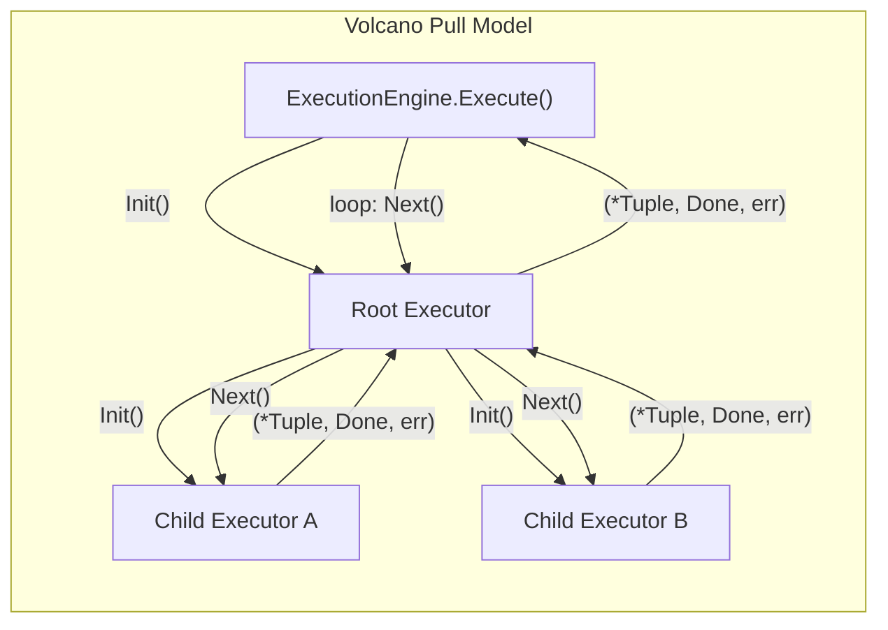
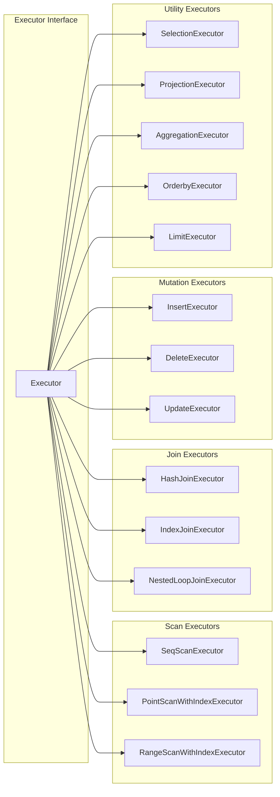

# Execution Engine

## 1. Overview

SamehadaDB uses a **Volcano/iterator model** execution engine. Every query plan produced by the planner (see [01_parser_planner.md](01_parser_planner.md)) is translated into a tree of **executor** objects, each implementing the same `Init()` / `Next()` interface. The `ExecutionEngine` orchestrates this tree: it creates the root executor, initializes it, and pulls tuples one at a time until the executor signals completion or an error triggers a transaction abort.

Key source files:

| Component | Path |
|---|---|
| ExecutionEngine | `lib/execution/executors/execution_engine.go` |
| Executor interface | `lib/execution/executors/executor.go` |
| ExecutorContext | `lib/execution/executors/executor_context.go` |
| Expression system | `lib/execution/expression/` |
| Materialization helpers | `lib/materialization/` |

## 2. Executor Interface

Every executor implements the following interface (defined in `lib/execution/executors/executor.go`):

```go
type Executor interface {
    Init()
    Next() (*Tuple, Done, error)
    GetOutputSchema() *schema.Schema
    GetTableMetaData() *catalog.TableMetadata
}
```

- **`Init()`** -- Performs one-time setup: opens iterators, builds hash tables, materializes child results, etc.
- **`Next()`** -- Returns the next output tuple. Returns `Done == true` when there are no more tuples.
- **`Done`** -- A `bool` alias. `true` signals exhaustion.
- **`GetOutputSchema()`** -- Returns the schema of tuples this executor produces.
- **`GetTableMetaData()`** -- Returns table metadata (may be nil for non-table executors).

### Data Flow Through a Plan Tree



Init cascades top-down (parent calls child's Init). Next calls pull bottom-up: a parent calls its child's `Next()` to get the next input tuple, processes it, and returns its own output tuple to whoever called it.

## 3. ExecutionEngine

**File:** `lib/execution/executors/execution_engine.go`

The `ExecutionEngine` is **stateless** -- it holds no mutable fields between calls.

### Execute Loop

```
Execute(plan, context) -> []Tuple
  1. executor = CreateExecutor(plan, context)
  2. executor.Init()
  3. loop:
       tuple, done, err = executor.Next()
       if err -> set txn state to ABORTED, return
       if done -> break
       collect tuple
  4. return collected tuples
```

If any executor returns an error, the engine immediately marks the transaction as `ABORTED` and stops pulling tuples.

### CreateExecutor Dispatch

`CreateExecutor` is a switch on the plan node type. It maps 14 plan types to their corresponding executor constructors:

| Plan Type | Executor |
|---|---|
| SeqScan | `SeqScanExecutor` |
| PointScanWithIndex | `PointScanWithIndexExecutor` |
| RangeScanWithIndex | `RangeScanWithIndexExecutor` |
| Insert | `InsertExecutor` |
| Delete | `DeleteExecutor` |
| Update | `UpdateExecutor` |
| HashJoin | `HashJoinExecutor` |
| IndexJoin | `IndexJoinExecutor` |
| NestedLoopJoin | `NestedLoopJoinExecutor` |
| Aggregation | `AggregationExecutor` |
| OrderBy | `OrderbyExecutor` |
| Selection | `SelectionExecutor` |
| Projection | `ProjectionExecutor` |
| Limit | `LimitExecutor` |

For executors that wrap a child plan (e.g., Delete wraps a scan), `CreateExecutor` is called recursively on the child plan to build the full executor tree.

## 4. Scan Executors

### SeqScanExecutor

**File:** `lib/execution/executors/seq_scan_executor.go`

Performs a full table scan using a `TableHeapIterator`. On each `Next()` call it:

1. Advances the heap iterator to the next tuple.
2. Evaluates the **selection predicate** inline (filter pushdown).
3. Applies **projection** to extract requested columns.
4. Preserves the original **RID** on the output tuple (needed by mutation executors downstream).

### PointScanWithIndexExecutor

**File:** `lib/execution/executors/point_scan_with_index_executor.go`

Performs an exact-match lookup via an index.

- **Init:** Extracts the scan key from the plan, calls `index.ScanKey()` to get matching RIDs, fetches tuples from the table heap, and caches them. Validates **key consistency** -- if the column value in the fetched tuple does not match the index key, the transaction is aborted (concurrent update detection).
- **Next:** Returns the next cached tuple.

### RangeScanWithIndexExecutor

**File:** `lib/execution/executors/range_scan_with_index_executor.go`

Performs range scans (e.g., `col > 5 AND col < 10`) using an index range iterator.

- **Init:** Creates a lazy range iterator on the index.
- **Next:** Advances the iterator, fetches the tuple from the heap, and validates key consistency. Handles three index types differently: `UniqSkipListIndex`, `SkipListIndex`, and `BTreeIndex`. Applies inline selection and projection.

## 5. Join Executors

### HashJoinExecutor

**File:** `lib/execution/executors/hash_join_executor.go`

Classic hash join with build and probe phases.

- **Build phase (Init):** Materializes the entire left (build) side into `TmpTuplePages` (see `lib/materialization/`). Builds a hash table mapping join-key hashes to lists of tuple pointers (`TmpTuple`).
- **Probe phase (Next):** For each tuple from the right (probe) side, hashes the join key, looks up matching left tuples in the hash table, validates the match, and emits joined tuples.
- **Cleanup:** Deallocates temporary pages used for materialization.

### IndexJoinExecutor

**File:** `lib/execution/executors/index_join_executor.go`

Uses an index on the right table to look up matching tuples for each left tuple.

- **Init:** Iterates over all left tuples. For each, extracts the join key and performs an index point lookup on the right table (with caching of results). Materializes all joined results.
- **Next:** Returns the next pre-computed result.

### NestedLoopJoinExecutor

**File:** `lib/execution/executors/nested_loop_join_executor.go`

Brute-force cross product with predicate filtering.

- **Init:** Materializes the entire right side. Then iterates over every (left, right) pair, stores matching results.
- **Next:** Returns the next stored result.

## 6. Mutation Executors

### InsertExecutor

**File:** `lib/execution/executors/insert_executor.go`

- `Next()` always returns `Done = true` in a single call (bulk operation).
- Creates tuples from the plan's raw values, inserts each into the table heap, then inserts entries into **all indexes** on the table.

### DeleteExecutor

**File:** `lib/execution/executors/delete_executor.go`

- Wraps a child executor (typically a scan) that identifies tuples to delete.
- For each tuple from the child: calls `MarkDelete` on the table heap, then calls `DeleteEntry` on every index.
- Checks if the child executor set the transaction to `ABORTED` before proceeding.

### UpdateExecutor

**File:** `lib/execution/executors/update_executor.go`

- Wraps a child executor that identifies tuples to update.
- Calls `UpdateTuple` (supports both full and partial updates). The update may cause the tuple to change its physical location on the page.
- **Index maintenance** handles three scenarios:
  1. **Indexed column value changed:** Delete old index entry, insert new entry.
  2. **Indexed column unchanged but tuple moved:** Update the RID in the index entry.
  3. **No change to indexed columns and no move:** No index operation needed.

## 7. Utility Executors

### SelectionExecutor

**File:** `lib/execution/executors/selection_executor.go`

Streaming filter. Pulls tuples from its child, evaluates a predicate expression, and passes matching tuples through. Non-matching tuples are skipped (calls child's `Next()` again).

### ProjectionExecutor

**File:** `lib/execution/executors/projection_executor.go`

Streaming column extraction. Pulls tuples from its child and constructs output tuples containing only the requested columns (matched by column name).

### AggregationExecutor

**File:** `lib/execution/executors/aggregation_executor.go`

Hash-based aggregation supporting `COUNT`, `SUM`, `MIN`, and `MAX`.

- Uses a `SimpleAggregationHashTable` internally: `map[uint32]*AggregateValue`.
- **Init:** Materializes the entire child, groups tuples by the group-by key hash, and computes running aggregates.
- **Next:** Iterates over the groups, applies the `HAVING` filter, and emits one tuple per qualifying group.

### OrderbyExecutor

**File:** `lib/execution/executors/orderby_executor.go`

- **Init:** Materializes all child tuples, then sorts them in-place using `sort.Slice` with a multi-column comparator supporting `ASC` and `DESC` directions.
- **Next:** Returns tuples in sorted order.

### LimitExecutor

**File:** `lib/execution/executors/limit_executor.go`

Streaming operator that enforces `OFFSET` and `LIMIT` semantics. Maintains two counters:

- **Skipped:** Counts tuples consumed (and discarded) to satisfy `OFFSET`.
- **Emitted:** Counts tuples returned; stops when `LIMIT` is reached.

## 8. Expression Evaluation

**Directory:** `lib/execution/expression/`

Expressions form trees that are evaluated against tuples at runtime. The `Expression` interface provides:

```go
type Expression interface {
    Evaluate(tuple *Tuple, schema *Schema) types.Value
    EvaluateJoin(leftTuple, rightTuple *Tuple, leftSchema, rightSchema *Schema) types.Value
    EvaluateAggregate(groupByKeys []types.Value, aggregateValues []types.Value) types.Value
    GetChildAt(idx uint32) Expression
    GetType() types.TypeID
}
```

### Expression Types

| Type | Description |
|---|---|
| **ColumnValue** | References a column by index. Contains `tupleIndexForJoin` (left=0, right=1 for join evaluation) and `colIndex`. |
| **ConstantValue** | A literal value. |
| **Comparison** | Binary comparison with 6 operators: `=`, `!=`, `<`, `<=`, `>`, `>=`. Evaluates its two children and compares their results. |
| **LogicalOp** | Logical connectives: `AND`, `OR`, `NOT`. Combines child expression results. |
| **AggregateValueExpression** | Used in aggregation context. Has `isGroupByTerm` flag and `termIdx` to index into either group-by keys or aggregate values. |

Expressions are evaluated bottom-up: leaf nodes (`ColumnValue`, `ConstantValue`) extract or produce values, and internal nodes (`Comparison`, `LogicalOp`) combine child results.

## 9. ExecutorContext

**File:** `lib/execution/executors/executor_context.go`

A simple container passed to every executor, providing access to shared resources:

| Field | Purpose |
|---|---|
| `catalog` | Schema and table metadata lookups (see [06_catalog_types.md](06_catalog_types.md)) |
| `bpm` | Buffer pool manager for page access (see [03_buffer_storage.md](03_buffer_storage.md)) |
| `txn` | Current transaction handle (see [05_transaction_recovery.md](05_transaction_recovery.md)) |

## 10. Executor Type Hierarchy



## 11. Design Decisions

- **Volcano model simplicity:** Each operator is independent and composable. Adding a new operator requires only implementing the `Executor` interface without modifying existing operators.
- **Inline selection in scans:** Both `SeqScanExecutor` and `RangeScanWithIndexExecutor` evaluate predicates and apply projection inline rather than relying on separate Selection/Projection operators above them. This reduces tuple copying for common scan patterns.
- **Materialization for joins and aggregation:** Hash join, index join, nested loop join, aggregation, and order-by all materialize their inputs during `Init()`. This simplifies the `Next()` logic but means these operators consume memory proportional to their input size.
- **Key consistency validation:** Index-based scan executors validate that the tuple fetched from the heap actually matches the index key. This detects concurrent modifications and triggers transaction abort, supporting the concurrency control layer (see [05_transaction_recovery.md](05_transaction_recovery.md)).
- **Stateless ExecutionEngine:** The engine itself holds no state between `Execute()` calls. All state lives in the executor tree and the transaction, making the engine safe for concurrent use.
- **TmpTuplePages for materialization:** The hash join executor uses `TmpTuplePages` (`lib/materialization/`) to store intermediate tuples in buffer-pool-managed pages rather than unbounded Go slices. Tuples are stored backwards from the page end, and each `TmpTuple` is a (pageID, offset) pointer.

## 12. Extension Guidelines: Adding a New Executor

1. **Define the plan node** in `lib/execution/plans/` implementing the `Plan` interface.
2. **Create the executor** in `lib/execution/executors/` implementing the `Executor` interface:
   - `Init()` -- Set up iterators, build data structures, recursively init children.
   - `Next()` -- Return one tuple per call; return `Done = true` when exhausted.
   - `GetOutputSchema()` -- Return the output schema.
3. **Register in CreateExecutor:** Add a case to the switch in `execution_engine.go` mapping your plan type to the new executor constructor.
4. **Wire into the planner** so it can generate your new plan node (see [01_parser_planner.md](01_parser_planner.md)).
5. **Handle index maintenance** if the executor modifies data -- update all indexes on the affected table.
6. **Check transaction state** if wrapping a child executor -- abort early if the child set the transaction to `ABORTED`.

---

**Cross-references:**
- Query parsing and plan generation: [01_parser_planner.md](01_parser_planner.md)
- Buffer pool and storage layer: [03_buffer_storage.md](03_buffer_storage.md)
- Index structures (skip list, B-tree, hash): [04_index.md](04_index.md)
- Transaction management and recovery: [05_transaction_recovery.md](05_transaction_recovery.md)
- Catalog and type system: [06_catalog_types.md](06_catalog_types.md)
