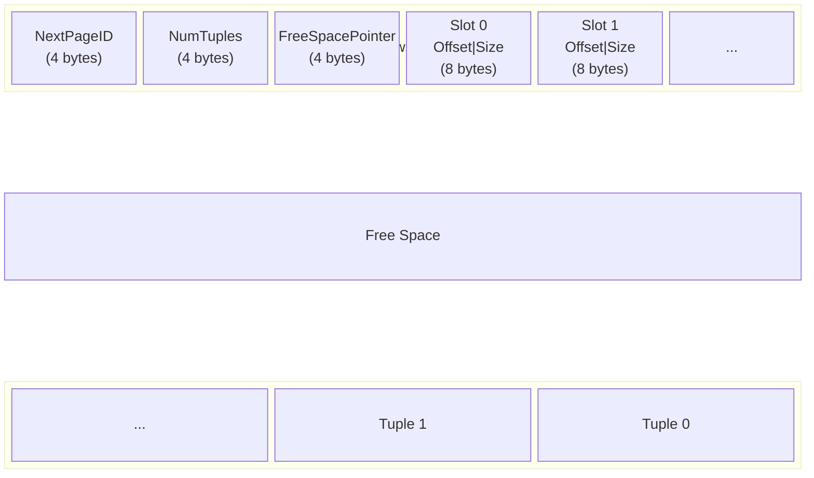
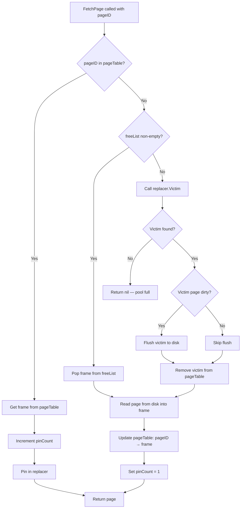

# Buffer Pool, Page Layout, and Disk I/O

## 1. Overview

SamehadaDB uses a buffer pool architecture to manage fixed-size pages between memory and disk. The system is built around 4KB pages, a clock-based replacement policy, and a slotted page format for tuple storage. By default, an in-memory virtual disk is used (`EnableOnMemStorage=true`), but a real file-backed disk manager is available.

Key configuration values (from `lib/common/config.go`):

| Parameter | Value | Purpose |
|-----------|-------|---------|
| `PageSize` | 4096 | Fixed page size in bytes |
| `EnableOnMemStorage` | true | Use in-memory storage by default |
| `BufferPoolMaxFrameNumForTest` | 32 | Buffer pool size for tests |
| `LogBufferSizeBase` | 128 | WAL log buffer base size |

## 2. Page Structure

**File:** `lib/storage/page/page.go`

A `Page` is the fundamental unit of storage. Every page is exactly 4KB.

```go
type Page struct {
    id       PageID                // unique page identifier
    pinCount int32                 // number of active references (0 = evictable)
    isDirty  bool                  // true if modified since last disk write
    rwLatch  ReaderWriterLatch     // reader-writer lock for concurrency
    data     [PageSize]byte        // raw 4KB data buffer
}
```

**Pin semantics:** A page with `pinCount > 0` is in use and must not be evicted. When all users call `UnpinPage`, the count reaches zero and the page becomes eligible for replacement.

### RID (Record Identifier)

A `RID` uniquely identifies a tuple within the database:

```go
type RID struct {
    PageId  PageID
    SlotNum uint32
}
```

The `PageID` locates the page; the `SlotNum` indexes into the slot array within that page's header.

## 3. TablePage Slotted Layout

**File:** `lib/storage/access/table_page.go`

`TablePage` uses a slotted page format. It is created by reinterpreting a `Page`'s memory via `unsafe.Pointer` (`CastPageAsTablePage`). The page data region is laid out as follows:



### Header fields

| Field | Size | Description |
|-------|------|-------------|
| NextPageID | 4 bytes | Links pages into a `TableHeap` chain (-1 if last) |
| NumTuples | 4 bytes | Number of slots (including deleted) |
| FreeSpacePointer | 4 bytes | Byte offset to the start of free space (decreases as tuples are added) |
| Slot directory | 8 bytes each | Array of (TupleOffset, TupleSize) pairs |

### Tuple storage

Tuples are inserted from the **end** of the page growing toward the header. Free space sits between the last slot directory entry and the first (lowest-offset) tuple. When free space is exhausted, the page is full.

### Deletion protocol

Deletion uses a two-phase approach to support transaction rollback (see [05_transaction_recovery.md](05_transaction_recovery.md)):

1. **MarkDelete:** Sets the high bit (`0x80000000`) of the tuple's size field. The tuple remains physically present. This is reversible via `RollbackDelete`.
2. **ApplyDelete:** Physically removes the tuple data and compacts the page, shifting other tuples to reclaim space.

### Key methods

- `InsertTuple(tuple, rid, txn, log)` — finds free space, writes tuple, returns RID
- `GetTuple(rid, txn, log)` — reads tuple at given slot
- `UpdateTuple(newTuple, oldTuple, rid, txn, log)` — replaces tuple in-place
- `MarkDelete(rid, txn, log)` — logical delete (sets high bit)
- `ApplyDelete(rid, txn, log)` — physical delete with compaction
- `RollbackDelete(rid, txn, log)` — clears the delete mark

## 4. BufferPoolManager

**File:** `lib/storage/buffer/buffer_pool_manager.go`

The `BufferPoolManager` mediates all page access between the execution engine and disk. No component reads or writes disk directly; everything goes through the buffer pool.

### Internal state

```go
type BufferPoolManager struct {
    pages           []*Page                // frame slots (fixed-size array)
    replacer        *ClockReplacer         // eviction policy
    freeList        []FrameID              // frames not currently holding a page
    pageTable       map[PageID]FrameID     // maps logical page → physical frame
    reUsablePageList []PageID              // recycled page IDs for reuse
    diskManager     DiskManager            // disk I/O backend
}
```

### FetchPage decision tree



### Core operations

| Method | Behavior |
|--------|----------|
| `FetchPage(pageID)` | Returns a pinned page from cache or disk (see diagram above) |
| `NewPage()` | Allocates a new page. Uses `reUsablePageList` first, otherwise calls `DiskManager.AllocatePage()`. Sets page dirty. |
| `UnpinPage(pageID, isDirty)` | Decrements `pinCount`. If dirty flag is true, marks page dirty. If `pinCount` reaches 0, adds frame to replacer. |
| `DeletePage(pageID)` | Removes page from buffer pool. Adds frame to `freeList` and page ID to `reUsablePageList`. Only succeeds if `pinCount == 0`. |
| `FlushPage(pageID)` | Writes page to disk unconditionally. |
| `FlushAllPages()` | Flushes every page in the pool. |
| `FlushAllDirtyPages()` | Flushes only pages with `isDirty == true`. |

## 5. ClockReplacer

**File:** `lib/storage/buffer/clock_replacer.go`

The `ClockReplacer` implements a clock (second-chance) algorithm that approximates LRU with lower overhead.

### Data structures

The replacer uses a `CircularList` (`lib/storage/buffer/circular_list.go`) — a doubly-linked circular list augmented with a hash map for O(1) membership testing and removal.

### Algorithm

Each frame in the replacer has a **reference bit**:

- **Pin(frameID):** Removes the frame from the replacer entirely (frame is in active use).
- **Unpin(frameID):** Adds the frame to the replacer with `ref = true` (frame is now a candidate for eviction).
- **Victim():** Advances the clock hand around the circular list:
  - If the current frame has `ref = true`, clear it to `false` and advance (second chance).
  - If the current frame has `ref = false`, evict it and return the frame ID.
  - If no victim is found after a full sweep, return failure (all frames pinned).

This gives recently-accessed frames a "second chance" before eviction, approximating LRU behavior without maintaining a full access-order list.

## 6. DiskManager Interface and Implementations

**File:** `lib/storage/disk/disk_manager.go`

The `DiskManager` interface abstracts all page-level I/O:

```go
type DiskManager interface {
    ReadPage(pageID PageID, data []byte)
    WritePage(pageID PageID, data []byte)
    AllocatePage() PageID
    DeallocatePage(pageID PageID)
}
```

### DiskManagerImpl (file-backed)

**File:** `lib/storage/disk/disk_manager_impl.go`

- Performs real file I/O with `os.File`
- Page location on disk: `pageID * PageSize` (direct offset mapping)
- Uses a mutex for thread safety
- Page IDs are allocated monotonically
- Suitable for persistent storage

### VirtualDiskManagerImpl (in-memory)

**File:** `lib/storage/disk/virtual_disk_manager_impl.go`

- Stores pages in an in-memory byte array
- Maintains a `spaceIDConvMap` for mapping recycled page IDs to physical storage slots
- Used as the default backend (`EnableOnMemStorage=true`) and for testing
- No persistence across restarts

## 7. TableHeap

**File:** `lib/storage/access/table_heap.go`

`TableHeap` organizes a table's data as a linked list of `TablePage` instances. It is the primary data structure for row-oriented tuple storage.

### Operations

- **InsertTuple:** Walks the page chain looking for a page with sufficient free space. If no page has room, allocates a new page and appends it to the chain. Uses a `lastPageID` optimization to avoid scanning from the beginning each time.
- **GetTuple / UpdateTuple / MarkDelete:** Locate the target page via the RID's `PageId`, then delegate to the corresponding `TablePage` method.

### TableHeapIterator

**File:** `lib/storage/access/table_heap_iterator.go`

Provides sequential scan over all tuples in a `TableHeap`:

- Iterates across pages by following the `NextPageID` chain
- Skips tuples marked as deleted
- Acquires read latches on pages during traversal for concurrency safety

The iterator is used by sequential scan operators in the execution engine and by index construction in the catalog (see [06_catalog_types.md](06_catalog_types.md) and [04_index.md](04_index.md)).

## 8. Page Recycling

When a page is deleted via `BufferPoolManager.DeletePage`, its page ID is added to `reUsablePageList`. On the next `NewPage()` call, the buffer pool checks this list before requesting a fresh allocation from the disk manager.

The `VirtualDiskManagerImpl` also maintains its own `spaceIDConvMap` to remap recycled page IDs to physical storage positions, preventing unbounded growth of the in-memory backing array.

This two-level recycling (buffer pool level and disk manager level) ensures that page IDs and storage space are reused efficiently.

## 9. Design Decisions

**Why a clock replacer instead of LRU?**
Clock approximates LRU with O(1) eviction cost and no need to reorder a list on every page access. The `CircularList` with its hash map provides O(1) pin/unpin while maintaining the clock scan order.

**Why unsafe.Pointer for TablePage?**
`CastPageAsTablePage` avoids copying the 4KB page data. The `TablePage` methods operate directly on the `Page`'s `data` array, providing zero-copy access to the slotted page structure.

**Why in-memory by default?**
`EnableOnMemStorage=true` simplifies testing and development. The `DiskManager` interface ensures that switching to persistent storage requires no changes to the buffer pool or upper layers.

**Why mark-delete before apply-delete?**
The two-phase deletion protocol supports transaction abort. A `MarkDelete` can be rolled back cheaply by clearing the high bit. Only after commit does `ApplyDelete` physically remove the tuple and compact the page. See [05_transaction_recovery.md](05_transaction_recovery.md) for the full recovery protocol.

## 10. Extension Guidelines

**Adding a new replacement policy:**
Implement the same interface as `ClockReplacer` (Pin, Unpin, Victim, Size methods) and inject it into `BufferPoolManager`. The replacer is a strategy object with no coupling to the rest of the system.

**Supporting variable-size pages:**
Currently all pages are fixed at `PageSize` (4096). Changing this requires updating `config.go`, the disk manager offset calculations (`pageID * PageSize`), and the `Page.data` array type.

**Adding a new disk backend:**
Implement the `DiskManager` interface. The buffer pool is agnostic to the storage medium. Potential backends include networked storage or memory-mapped files.

**Integrating with indexes:**
Index structures (see [04_index.md](04_index.md)) use the same buffer pool for their pages. B+tree internal and leaf nodes are stored as pages managed by `BufferPoolManager`, sharing the same eviction and flushing policies as data pages.
