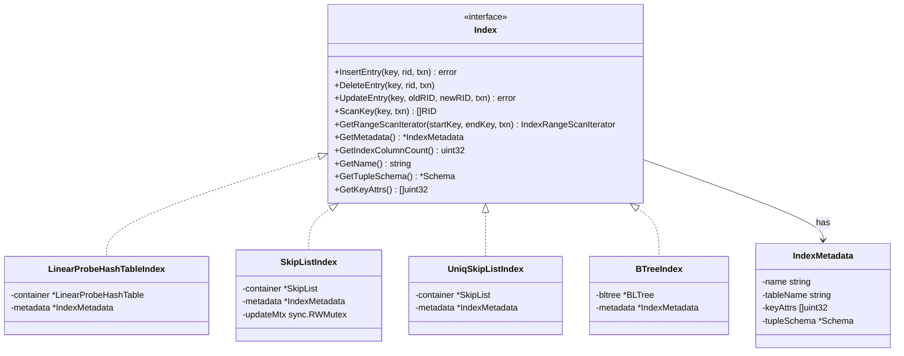
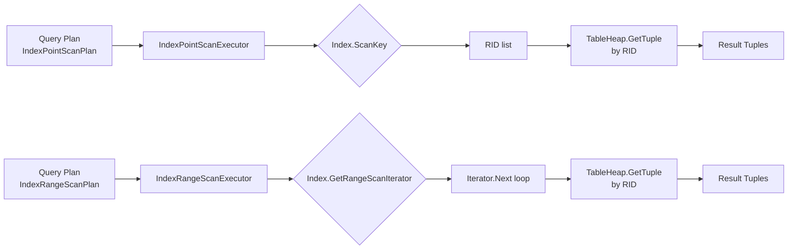

# Index Implementations

## 1. Overview

SamehadaDB provides four index implementations that share a common `Index` interface. Each trades off between point-query speed, range-scan support, and key-uniqueness enforcement. Indexes are created at table-creation time based on column metadata and are maintained automatically during DML operations.

Key source files:

| Component | Path |
|-----------|------|
| Index interface & metadata | `lib/storage/index/index.go` |
| Index kind constants | `lib/storage/index/index_constants/index_constants.go` |
| Hash table index | `lib/storage/index/linear_probe_hash_table_index.go` |
| Skip list index (non-unique) | `lib/storage/index/skip_list_index.go` |
| Unique skip list index | `lib/storage/index/uniq_skip_list_index.go` |
| B-tree index | `lib/storage/index/btree_index.go` |
| Skip list container | `lib/container/skip_list/skip_list.go` |
| Hash table container | `lib/container/hash/linear_probe_hash_table.go` |
| Index recovery | `lib/samehada/samehada.go` (function `reconstructIndexDataOfATbl`) |

**Capability summary:**

| Feature | Hash | UniqSkipList | SkipList | BTree |
|---------|------|--------------|----------|-------|
| Unique keys | No | Yes | No | No |
| Range scan | No | Yes | Yes | Yes |
| Point query | O(1) avg | O(log n) | O(log n) | O(log n) |
| Key encoding | None | Native | Composite | Composite |
| UpdateEntry | No | Yes | Yes | Yes |
| Persistence | Buffer pool pages | Buffer pool pages | Buffer pool pages | Custom BufMgr over BPM |

---

## 2. Index Interface & IndexMetadata

### IndexMetadata

`IndexMetadata` (`lib/storage/index/index.go`) captures the structural description of an index:

- **name** -- human-readable index name.
- **tableName** -- the table this index belongs to.
- **keyAttrs** -- `[]uint32` column ordinals that form the index key (composite keys supported structurally, though current usage is single-column).
- **tupleSchema** -- the `Schema` describing the indexed columns, extracted from the table schema.

### Index interface

Every index implementation satisfies the following interface:

```go
type Index interface {
    InsertEntry(key *tuple.Tuple, rid page.RID, txn interface{}) error
    DeleteEntry(key *tuple.Tuple, rid page.RID, txn interface{})
    UpdateEntry(key *tuple.Tuple, oldRID page.RID, newRID page.RID, txn interface{}) error
    ScanKey(key *tuple.Tuple, txn interface{}) []page.RID
    GetRangeScanIterator(startKey *tuple.Tuple, endKey *tuple.Tuple, txn interface{}) IndexRangeScanIterator
    GetMetadata() *IndexMetadata
    GetIndexColumnCount() uint32
    GetName() string
    GetTupleSchema() *schema.Schema
    GetKeyAttrs() []uint32
}
```

### Class diagram



### IndexKind constants

Defined in `lib/storage/index/index_constants/index_constants.go`:

| Constant | Value | Description |
|----------|-------|-------------|
| `IndexKindInvalid` | 0 | No index |
| `IndexKindUniqSkipList` | 1 | Unique skip list |
| `IndexKindSkipList` | 2 | Non-unique skip list |
| `IndexKindHash` | 3 | Linear-probe hash table |
| `IndexKindBtree` | 4 | B-tree (external library) |

---

## 3. Hash Table Index

**File:** `lib/storage/index/linear_probe_hash_table_index.go`

The hash index wraps a `LinearProbeHashTable` container (`lib/container/hash/linear_probe_hash_table.go`).

### Design

- **Hash function:** Murmur3.
- **Collision resolution:** Linear probing.
- **Storage:** A header page plus block pages, all managed through the buffer pool. The header page holds up to 1020 bucket pointers. Each block page stores entries as 16-byte slots (8-byte key hash + 8-byte value) with occupied/readable bitmaps.
- **Maximum capacity:** `BlockArraySize * 252` which yields approximately 257,000 entries.

### Limitations

- **No uniqueness enforcement.** Multiple entries with the same key are permitted.
- **`UpdateEntry` is not supported** -- callers must delete and re-insert.
- **`GetRangeScanIterator` is not supported** -- returns nil / panics. Hash indexes only serve point queries.

### When to use

Best for equality-only predicates on columns with high cardinality where O(1) average lookup time matters and range scans are never needed.

---

## 4. Skip List Index (Non-Unique)

**File:** `lib/storage/index/skip_list_index.go`

### Composite key encoding for non-unique indexes

The skip list data structure is inherently a unique-key map. To support non-unique index keys (e.g., multiple rows sharing the same value in an indexed column), the skip list index uses a **composite key encoding** technique:

1. The original key value and the tuple's RID (Record ID) are combined into a single dictionary-order-comparable varchar via `samehada_util.EncodeValueAndRIDToDicOrderComparableVarchar()`.
2. Because every (key, RID) pair is globally unique, the skip list treats each composite as a unique entry.
3. To perform a **point query** (`ScanKey`), the index does a range scan between `(searchKey, MinRID)` and `(searchKey, MaxRID)`, collecting all RIDs whose original key portion matches.

This encoding is the central trick that allows ordered data structures (skip list, B-tree) to handle non-unique keys without requiring bucket or overflow structures.

### Concurrency

A `sync.RWMutex` (`updateMtx`) protects mutations:

- `InsertEntry` and `DeleteEntry` acquire a write lock.
- `UpdateEntry` also acquires a write lock, performing an atomic delete-then-insert of the composite key.
- Read operations (`ScanKey`, `GetRangeScanIterator`) acquire a read lock.

### Container

The underlying `SkipList` container (`lib/container/skip_list/skip_list.go`) is buffer-pool-backed:

- A header page stores skip list metadata.
- Block pages use a slotted format with forward pointers supporting up to 20 levels.
- `SkipListIterator` pre-loads matching entries into memory for iteration.

---

## 5. Unique Skip List Index

**File:** `lib/storage/index/uniq_skip_list_index.go`

### Design

- Stores keys **directly** without composite encoding. The key value itself is stored in the skip list, mapping to the tuple's RID.
- **Uniqueness is enforced naturally** by the skip list: inserting a duplicate key overwrites the previous entry (or is rejected, depending on the caller's logic).
- `ScanKey` returns either a single RID or an empty slice. A sentinel value of `math.MaxUint64` indicates "not found."
- Supports `UpdateEntry` and `GetRangeScanIterator`.

### When to use

Use for primary keys, unique constraints, or any column where at most one row may have a given value.

---

## 6. B-Tree Index

**File:** `lib/storage/index/btree_index.go`

### External library

The B-tree index delegates to an external library: `github.com/ryogrid/bltree-go-for-embedding`. This is a B-link tree implementation adapted for embedding within SamehadaDB.

### Key details

- **Non-unique keys** via the same composite encoding used by the skip list index (`EncodeValueAndRIDToDicOrderComparableVarchar`).
- **RID packing:** The RID is packed into 6 bytes (4 bytes for PageID + 2 bytes for SlotNum) to minimize key overhead.
- **Maximum key length:** 50 bytes.
- **Persistence:** A custom `BufMgr` wraps SamehadaDB's `BufferPoolManager`, so B-tree pages participate in the normal buffer pool. At shutdown, `WriteOutContainerStateToBPM()` flushes dirty B-tree state.
- Supports `UpdateEntry` and `GetRangeScanIterator`.

### Trade-offs vs. skip list

The B-tree offers better worst-case I/O behavior for large datasets because its fan-out is typically higher than a skip list's branching factor. However, the skip list is simpler and avoids page splits.

---

## 7. IndexRangeScanIterator

All indexes that support range scans return an `IndexRangeScanIterator`:

```go
type IndexRangeScanIterator interface {
    Next() (done bool, err error, key *types.Value, rid *page.RID)
}
```

- **`Next()`** advances the iterator and returns the next key-value pair (the key and the RID of the matching tuple).
- When `done` is `true`, iteration is complete.
- Hash indexes do **not** support this interface.

Callers (typically the `IndexRangeScanExecutor`) use this iterator in a loop, fetching tuple RIDs and then retrieving the actual tuples from the table heap. See [02_execution_engine.md](02_execution_engine.md) for executor details.

---

## 8. Index Selection in the Optimizer

The planner/optimizer decides whether to use an index scan or a sequential scan based on predicate analysis. When a WHERE clause contains an equality or range predicate on an indexed column, the optimizer may choose `IndexPointScanPlan` or `IndexRangeScanPlan` instead of `SeqScanPlan`.

For details on plan selection and cost-based decisions, see [01_parser_planner.md](01_parser_planner.md).

---

## 9. Index Maintenance During DML

Indexes are maintained transparently during insert, update, and delete operations:

- **Insert:** After a tuple is inserted into the table heap, each index on the table receives an `InsertEntry` call with the relevant column value(s) and the new RID.
- **Delete:** Before or after a tuple is removed, each index receives a `DeleteEntry` call.
- **Update:** Indexes that support `UpdateEntry` receive the old and new RIDs. Those that do not (hash index) require a delete followed by an insert.

See [02_execution_engine.md](02_execution_engine.md) for the executor-level implementation of index maintenance.

---

## 10. Index Recovery

**Function:** `reconstructIndexDataOfATbl` in `lib/samehada/samehada.go`

After a crash, indexes may be inconsistent with the table data (especially hash indexes, which lack WAL-based redo). The recovery procedure:

1. **Clear** old index data (drop existing entries).
2. **Full table scan:** Iterate over every tuple in the table heap.
3. **Rebuild:** For each live tuple, insert its key and RID into every index on the table.

This is called during SamehadaDB startup after WAL-based recovery has restored the table heap to a consistent state. See [05_transaction_recovery.md](05_transaction_recovery.md) for the overall recovery sequence.

---

## 11. Index Lookup Flow

The following diagram shows the path from query plan to tuple retrieval via an index:



---

## 12. Design Decisions

**Why four index types?**
Each serves a different niche. The hash index is the fastest for pure equality lookups on bounded-size tables. The skip list indexes are general-purpose ordered indexes. The B-tree offers better disk-oriented behavior for large datasets. Having all four allows the schema designer (or future cost-based optimizer) to pick the best fit.

**Why composite key encoding instead of bucket chains?**
Encoding (key + RID) into a single comparable value avoids the complexity of overflow pages or linked-list buckets. It also means the skip list and B-tree need no structural changes to handle non-unique keys -- they remain simple unique-key maps internally.

**Why an external B-tree library?**
Writing a correct, concurrent B-link tree is complex. Using `bltree-go-for-embedding` avoids reimplementation while still integrating with SamehadaDB's buffer pool through a custom `BufMgr` adapter.

**Why rebuild indexes on recovery?**
Hash indexes are not WAL-logged at the entry level, so the simplest correct approach is to rebuild from the recovered heap. This trades recovery speed for implementation simplicity.

---

## 13. Extension Guidelines

### Adding a new index type

1. Define a new `IndexKind` constant in `lib/storage/index/index_constants/index_constants.go`.
2. Implement the `Index` interface in a new file under `lib/storage/index/`.
3. If the index requires a new container data structure, add it under `lib/container/`.
4. Wire the new kind into the index-creation logic in catalog/table metadata construction (see [06_catalog_types.md](06_catalog_types.md) for catalog structure).
5. If the index needs special recovery handling, update `reconstructIndexDataOfATbl` in `lib/samehada/samehada.go`.

### Adding composite (multi-column) index support

The `IndexMetadata.keyAttrs` field already supports multiple column ordinals. To enable multi-column indexes:

1. Extend the key encoding functions to handle multiple column values.
2. Update the planner to recognize multi-column index opportunities.
3. Ensure the composite key respects dictionary ordering across all included columns.

---

## Cross-References

- [01_parser_planner.md](01_parser_planner.md) -- Plan node selection for index scans
- [02_execution_engine.md](02_execution_engine.md) -- Executor-level index maintenance during DML
- [03_buffer_storage.md](03_buffer_storage.md) -- Buffer pool management used by all index containers
- [05_transaction_recovery.md](05_transaction_recovery.md) -- WAL recovery and index rebuild sequencing
- [06_catalog_types.md](06_catalog_types.md) -- Catalog integration and `TableMetadata.indexes`
