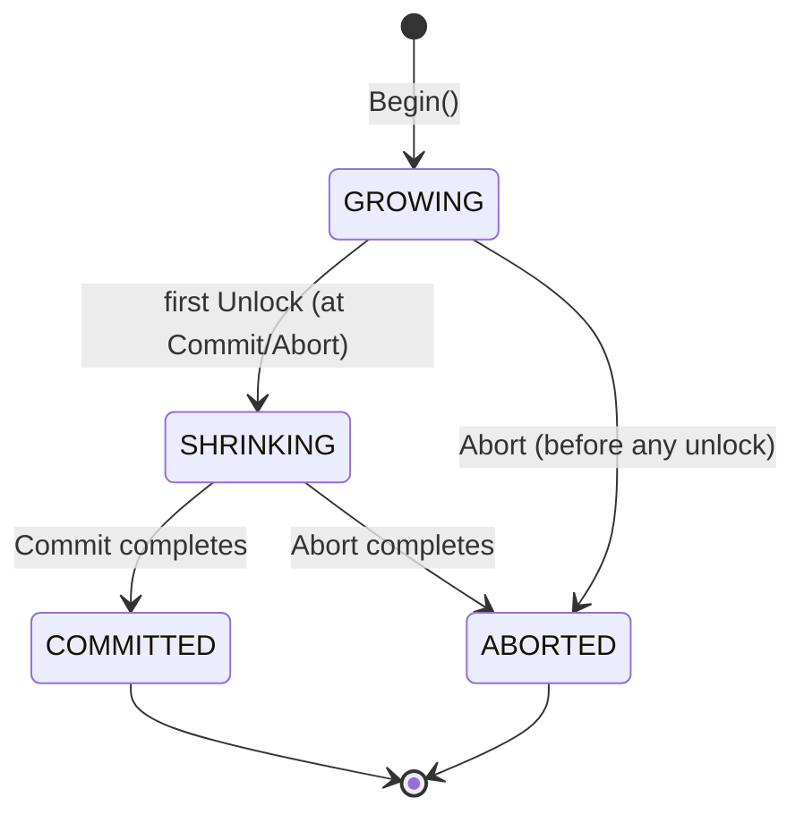
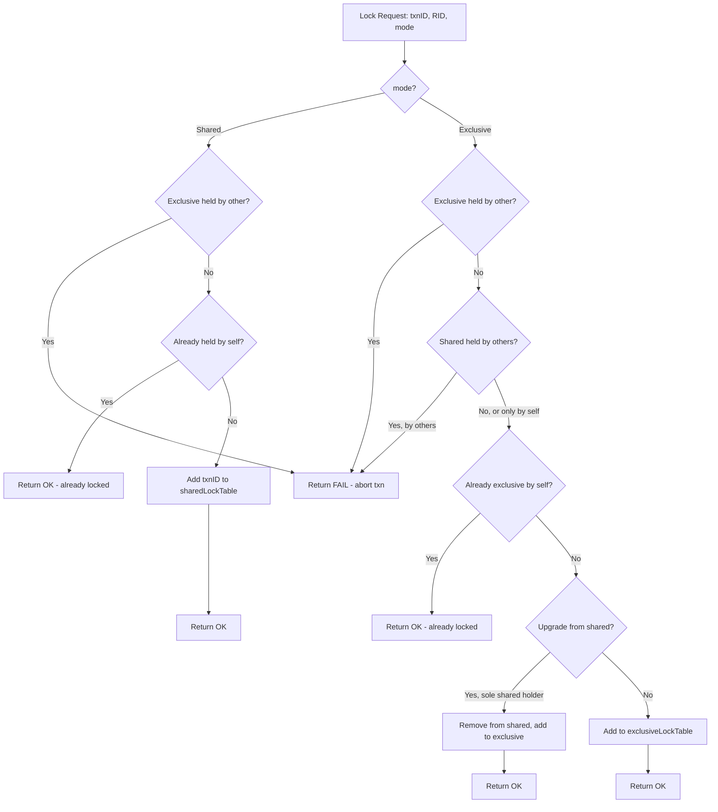
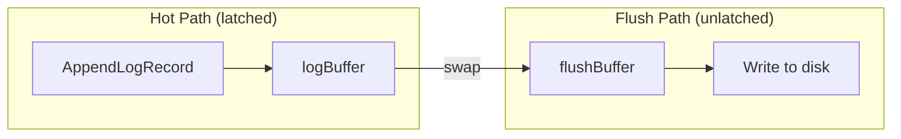

# Transactions, Locking, WAL, and Recovery

## 1. Overview

SamehadaDB implements a classic database transaction system built on three pillars:

- **Strict Two-Phase Locking (SS2PL-NW)** for concurrency control -- no-wait variant eliminates deadlocks by aborting immediately on lock conflict.
- **Write-Ahead Logging (WAL)** with a double-buffer design for durability and crash recovery.
- **ARIES-style Recovery** with a redo-then-undo protocol that restores the database to a consistent state after a crash.

These components interact through a layered architecture:

```
RequestManager (concurrent SQL dispatch, abort/retry)
    |
TransactionManager (Begin / Commit / Abort lifecycle)
    |
    +-- LockManager (SS2PL-NW row-level locking)
    +-- LogManager (WAL double-buffer append & flush)
    +-- CheckpointManager (periodic dirty-page flush)
    |
LogRecovery (ARIES redo/undo on startup)
```

Key source files:

| Component | Path |
|---|---|
| Transaction | `lib/storage/access/transaction.go` |
| TransactionManager | `lib/storage/access/transaction_manager.go` |
| LockManager | `lib/storage/access/lock_manager.go` |
| LogManager | `lib/recovery/log_manager.go` |
| LogRecord | `lib/recovery/log_record.go` |
| LogRecovery | `lib/recovery/log_recovery/log_recovery.go` |
| CheckpointManager | `lib/concurrency/checkpoint_manager.go` |
| ReaderWriterLatch | `lib/common/rwlatch.go` |
| RequestManager | `lib/samehada/request_manager.go` |

---

## 2. Transaction Lifecycle

### States

A transaction progresses through a strict state machine:



- **GROWING** -- the transaction acquires locks but never releases them. All data operations happen here.
- **SHRINKING** -- locks are being released. No new locks may be acquired (enforced by SS2PL).
- **COMMITTED** -- all changes are durable; locks released.
- **ABORTED** -- all changes rolled back; locks released.

### Transaction Struct

The `Transaction` struct (`lib/storage/access/transaction.go`) holds all per-transaction state:

| Field | Type | Purpose |
|---|---|---|
| `state` | `TxnState` | Current lifecycle state |
| `txnID` | `TxnID` | Unique monotonic identifier |
| `writeSet` | `[]WriteRecord` | Ordered log of all write operations for undo |
| `prevLSN` | `types.LSN` | LSN of the last log record written by this txn |
| `sharedLockSet` | set of RID | Rows holding a shared (read) lock |
| `exclusiveLockSet` | set of RID | Rows holding an exclusive (write) lock |
| `abortable` | `bool` | Whether the txn can still be aborted |
| `isRecoveryPhase` | `bool` | True during crash recovery replay |
| `dbgInfo` | | Debug tracing metadata |

### WriteRecord

Each mutation appended to `writeSet` captures enough information to undo the operation:

| Field | Purpose |
|---|---|
| `wtype` | One of: `INSERT`, `DELETE`, `UPDATE`, `ReserveSpace` |
| `rid1`, `rid2` | Row identifiers (rid2 used for UPDATE to track old location) |
| `tuple1`, `tuple2` | Before/after tuple data |
| `table` | Reference to the `TableHeap` owning this row |
| `oid` | Object (table) identifier for index updates during undo |

The write set is iterated **in reverse** during both commit and abort to correctly unwind or finalize operations.

---

## 3. TransactionManager

`TransactionManager` (`lib/storage/access/transaction_manager.go`) orchestrates the full lifecycle. It holds:

- `nextTxnID` -- atomic counter for unique IDs.
- `lockManager` -- the SS2PL-NW lock manager.
- `logManager` -- the WAL log manager.
- `globalTxnLatch` -- a `sync.RWMutex` used by checkpointing to block all transactions.
- `txnMap` -- a `sync.Map` mapping `TxnID` to `*Transaction`.

### Begin

1. Acquire `globalTxnLatch.RLock()` (allows concurrent transactions; checkpoint takes WLock to block).
2. Allocate a new `TxnID` from the atomic counter.
3. Create a `Transaction` in the `GROWING` state.
4. Write a `BEGIN` log record via `LogManager`.
5. Register the transaction in `txnMap`.

### Commit

1. Mark the transaction as **non-abortable** (prevents concurrent abort attempts).
2. Walk the `writeSet` in **reverse order** and finalize deletes:
   - `DELETE` write type: call `ApplyDelete` to physically remove the marked-deleted tuple.
   - `UPDATE` write type: call `ApplyDelete` on the old tuple location (the new location is already live).
3. Write a `COMMIT` log record.
4. **Flush** the log to disk (guarantees durability before returning success).
5. Release all locks (shared and exclusive) via `LockManager.Unlock`.
6. Release `globalTxnLatch.RUnlock()`.

### Abort

1. Mark the transaction as **non-abortable**.
2. Walk the `writeSet` in **reverse order** and apply inverse operations:
   - `DELETE` -- call `RollbackDelete` (unsets the delete mark) and restore index entries.
   - `INSERT` -- call `ApplyDelete` (physically remove the inserted tuple) and remove index entries.
   - `UPDATE` -- restore the original tuple data and update index entries.
3. Write an `ABORT` log record.
4. Release all locks.
5. Release `globalTxnLatch.RUnlock()`.

---

## 4. Lock Manager: SS2PL-NW

The lock manager (`lib/storage/access/lock_manager.go`) implements **Strict Two-Phase Locking with No-Wait** (SS2PL-NW). This is a conservative but deadlock-free strategy.

### Data Structures

- `sharedLockTable`: `map[RID][]TxnID` -- tracks which transactions hold a shared lock on each row.
- `exclusiveLockTable`: `map[RID]TxnID` -- tracks which transaction holds an exclusive lock on each row.

### Lock Acquisition Flow



### Key Properties

- **No-Wait**: if a lock cannot be granted immediately, the request fails and the transaction must abort. There is no wait queue. This eliminates deadlocks entirely.
- **Strict**: all locks are held until commit or abort (never released early). This guarantees serializability and prevents cascading aborts.
- **Lock Upgrade**: a transaction holding the only shared lock on a row can upgrade to exclusive without conflict.

### Unlock

`Unlock(txn, rid)` removes the transaction from both `sharedLockTable` and `exclusiveLockTable` for the given RID. Called during commit/abort lock release.

---

## 5. Mark-Delete Protocol

SamehadaDB uses a two-phase delete protocol to support transactional rollback of deletes. This is implemented in the tuple storage layer and referenced from [03_buffer_storage.md](03_buffer_storage.md).

### Three Operations

1. **MarkDelete** -- sets the high bit (`deleteMask = 0x80000000`) in the tuple's size field. The tuple remains physically present and visible to the owning transaction's undo logic, but is logically deleted.

2. **ApplyDelete** -- physically removes the tuple from the page (called at commit time for `DELETE` and `UPDATE` write types). This is the point of no return.

3. **RollbackDelete** -- unsets the delete bit, restoring the tuple to a normal state (called during abort for `DELETE` write types).

### Flow by Operation Type

| Operation | On Commit | On Abort |
|---|---|---|
| DELETE | `ApplyDelete` (physical removal) | `RollbackDelete` (restore) + re-add index entries |
| INSERT | No action needed (already live) | `ApplyDelete` (remove inserted tuple) + remove index entries |
| UPDATE | `ApplyDelete` old location | Restore original tuple + update indexes |

---

## 6. Write-Ahead Logging (WAL)

### Double-Buffer Design

The `LogManager` (`lib/recovery/log_manager.go`) uses a double-buffer strategy to decouple log appending from disk I/O:



- **`logBuffer`** -- active buffer where `AppendLogRecord` serializes new records.
- **`flushBuffer`** -- secondary buffer written to disk during `Flush()`.
- **`Flush()`** -- acquires the latch, swaps the two buffers, releases the latch, then writes `flushBuffer` to disk without holding the latch. This allows concurrent appends during disk I/O.

### Key Fields

| Field | Purpose |
|---|---|
| `nextLSN` | Monotonically increasing LSN assigned to each new record |
| `persistentLSN` | Highest LSN known to be on disk |
| `logBufferLSN` | LSN watermark of the current logBuffer |
| `offset` | Current write position within logBuffer |

### Log Record Format

Every log record starts with a fixed 20-byte header:

```
+--------+--------+--------+----------+---------------+
| Size   | LSN    | TxnID  | PrevLSN  | LogRecordType |
| 4 bytes| 4 bytes| 4 bytes| 4 bytes  | 4 bytes       |
+--------+--------+--------+----------+---------------+
```

- **Size** -- total record size including header.
- **LSN** -- log sequence number assigned by `AppendLogRecord`.
- **TxnID** -- owning transaction.
- **PrevLSN** -- LSN of the previous record by this same transaction (forms the undo chain).
- **LogRecordType** -- discriminator for the payload.

### Log Record Types

| Type | Payload |
|---|---|
| `BEGIN` | Header only |
| `COMMIT` | Header only |
| `ABORT` | Header only |
| `INSERT` | Header + RID (PageID + SlotNum) + TupleSize + TupleData |
| `MARKDELETE` | Header + RID + TupleSize + TupleData |
| `APPLYDELETE` | Header + RID + TupleSize + TupleData |
| `ROLLBACKDELETE` | Header + RID + TupleSize + TupleData |
| `UPDATE` | Header + RID + OldTupleSize + OldTupleData + NewTupleSize + NewTupleData |
| `NewTablePage` | Header + page metadata |
| `DeallocatePage` | Header + page metadata |
| `ReusePage` | Header + page metadata |
| `GracefulShutdown` | Header only (signals clean shutdown) |

### WAL Protocol

The WAL rule is enforced: a page's modifications are logged **before** the page is written to disk. This is ensured by:

1. Every data modification calls `AppendLogRecord` before modifying the page.
2. Commit calls `Flush()` to guarantee the COMMIT record reaches disk before returning success to the client.
3. The buffer pool manager checks page LSN against persistent LSN before evicting dirty pages.

---

## 7. ARIES Recovery

The recovery manager (`lib/recovery/log_recovery/log_recovery.go`) implements a simplified ARIES protocol with two phases: **Redo** and **Undo**.

Recovery runs at startup if the log does not end with a `GracefulShutdown` record.

### Phase 1: Redo (Forward Pass)

Reads the log from the beginning and replays every operation:

1. For each log record in order:
   - If the record's LSN > the page's current LSN, apply the operation (the page is stale and needs this update).
   - If the record's LSN <= the page's LSN, skip (already applied -- this makes redo idempotent).
2. Track `activeTxn` set: add on `BEGIN`, remove on `COMMIT`/`ABORT`.
3. Build `lsnMapping`: maps each transaction to its last log record LSN (used in undo).

Redo restores the database to its exact pre-crash state, including uncommitted changes.

### Phase 2: Undo (Backward Pass)

Rolls back all transactions that were active (uncommitted) at crash time:

1. For each active transaction, start from its last LSN (from `lsnMapping`).
2. Follow the `PrevLSN` chain backward, applying the inverse of each operation:
   - `INSERT` record -> `ApplyDelete` (remove the row).
   - `MARKDELETE` record -> `RollbackDelete` (restore the row).
   - `UPDATE` record -> restore the old tuple.
3. Continue until the `BEGIN` record is reached.

### GracefulShutdown Optimization

If the last log record is a `GracefulShutdown` record, the undo phase is skipped entirely. This record is written during a clean shutdown after all transactions have completed, confirming no active transactions need rollback.

---

## 8. Checkpointing

The `CheckpointManager` (`lib/concurrency/checkpoint_manager.go`) runs a periodic checkpoint every **30 seconds** to bound recovery time.

### Checkpoint Procedure

1. **BeginCheckpoint**: acquire `globalTxnLatch.WLock()`. This blocks all new transaction operations (which hold RLock). Existing in-flight operations complete before the WLock is granted.
2. **Flush all dirty pages** from the buffer pool to disk.
3. **Flush the WAL** to ensure all log records are persistent.
4. **EndCheckpoint**: release `globalTxnLatch.WUnlock()`, resuming normal transaction processing.

### Impact on Recovery

After a checkpoint, all pages on disk are up-to-date through some LSN. Recovery redo can still start from the log beginning (this is a simplified approach), but dirty pages are fewer, making recovery faster in practice.

---

## 9. Concurrency Primitives

### ReaderWriterLatch

`lib/common/rwlatch.go` provides a wrapper around `sync.RWMutex` with three variants:

| Variant | Purpose |
|---|---|
| Standard | Wraps `sync.RWMutex` directly |
| Debug | Tracks lock/unlock counts for debugging |
| Dummy | No-op implementation for single-threaded testing |

### Latch Hierarchy

To prevent deadlocks, latches are acquired in a strict order:

```
globalTxnLatch (RW)          -- coarsest: checkpoint vs. all transactions
    |
    +-- LockManager mutex    -- protects lock tables
    |
    +-- Page latches (RW)    -- per-page access in buffer pool
    |
    +-- LogManager latch     -- protects log buffer append
```

- **globalTxnLatch**: `sync.RWMutex` in `TransactionManager`. Transactions hold `RLock`; checkpoints hold `WLock`. This ensures no transaction is mid-operation during a checkpoint.
- **LockManager mutex**: protects `sharedLockTable` and `exclusiveLockTable` from concurrent modification.
- **Page latches**: each buffer pool frame has a `ReaderWriterLatch` controlling concurrent page access (see [03_buffer_storage.md](03_buffer_storage.md)).
- **LogManager latch**: serializes access to the active log buffer.

---

## 10. RequestManager Concurrency

The `RequestManager` (`lib/samehada/request_manager.go`) handles concurrent SQL execution with automatic abort-retry logic.

### Architecture

- Maintains a queue of `queryRequest` structs, each containing: `reqID`, `queryStr`, and `callerCh` (result channel).
- A main `Run` loop dispatches queries to worker goroutines, up to `MaxTxnThreadNum` concurrent workers.
- Each worker calls `ExecuteSQLForTxnTh`, which executes the query within a transaction.

### Abort/Retry Loop

When a transaction aborts due to a lock conflict (SS2PL-NW returns failure):

1. The worker goroutine returns a `QueryAbortedErr`.
2. The `Run` loop detects this error.
3. The failed query is **re-queued at the head** of the request queue.
4. The query is retried in a new transaction with a new `TxnID`.

This retry mechanism is transparent to the caller. The caller's channel only receives the final successful result or a non-retryable error.

### Flow

```
Client -> queryRequest -> Run loop -> worker goroutine -> ExecuteSQLForTxnTh
                              ^                                    |
                              |                                    v
                              +---- re-queue on QueryAbortedErr <--+
```

---

## 11. Design Decisions

### No-Wait Over Wait-Die or Wound-Wait

SamehadaDB chose **no-wait** locking over timeout-based or priority-based deadlock strategies. Trade-offs:

- **Pro**: Zero deadlock possibility. No deadlock detection overhead. Simple implementation.
- **Pro**: Combined with the RequestManager retry loop, aborted transactions are automatically retried.
- **Con**: Higher abort rate under contention compared to wait-based schemes.
- **Con**: Starvation is possible in theory (a transaction could be repeatedly aborted), though the retry mechanism mitigates this.

### Strict 2PL (Not Basic 2PL)

All locks are held until transaction end. This provides:

- **Serializability**: guaranteed by 2PL.
- **Recoverability**: no cascading aborts since no transaction can read uncommitted data from a lock-protected row.
- **Simplicity**: no need to track which locks can be released early.

### Double-Buffer WAL

The swap-on-flush design minimizes the critical section:

- Appending to `logBuffer` requires the latch only for the memcpy duration.
- Disk I/O for `flushBuffer` proceeds without holding the latch.
- This is simpler than a ring buffer but effective for the expected workload.

### Mark-Delete Two-Phase Protocol

Separating mark from apply enables:

- Clean abort semantics (just unset the bit).
- Visibility control (marked tuples can be filtered in scans).
- Deferred physical cleanup at commit time.

### Simplified ARIES

The recovery implementation omits some full ARIES features:

- No **Analysis phase** (the redo pass implicitly discovers active transactions).
- No **checkpoint log records** that record the active transaction table and dirty page table (redo always starts from the beginning of the log).
- The `GracefulShutdown` record provides a fast path to skip undo entirely.

---

## 12. Extension Guidelines

### Adding a New Log Record Type

1. Define the new type constant in `lib/recovery/log_record.go`.
2. Implement serialization: append the payload after the 20-byte header.
3. Implement deserialization in the log record constructor.
4. Add redo logic in `LogRecovery.Redo()` for the new type.
5. If the operation is undoable, add undo logic in `LogRecovery.Undo()`.
6. Add the corresponding `AppendLogRecord` call at the operation site.

### Adding a New Lock Mode

1. Add a new lock table (e.g., `intentionLockTable`) in `lib/storage/access/lock_manager.go`.
2. Define compatibility rules with existing shared/exclusive modes.
3. Update `LockShared`, `LockExclusive`, and `Unlock` to check the new table.
4. Update `Transaction` to track the new lock set.
5. Ensure the no-wait property is preserved (fail immediately on conflict).

### Adding Wait-Based Locking

If moving away from no-wait:

1. Add a wait queue per RID in the lock manager.
2. Implement a deadlock detection strategy (e.g., wait-for graph cycle detection).
3. Remove or modify the RequestManager retry loop (fewer aborts expected).
4. Add timeout mechanisms to prevent indefinite waits.

### Improving Recovery Performance

1. **Fuzzy checkpointing**: write a checkpoint log record with the active transaction table and dirty page table, allowing redo to start from the checkpoint instead of the log beginning.
2. **Log truncation**: after a successful checkpoint, log records before the checkpoint can be discarded.
3. **Parallel redo**: partition pages across workers for concurrent redo.

---

## Cross-References

- **Buffer Pool and Page Management**: [03_buffer_storage.md](03_buffer_storage.md) -- page latching, dirty page tracking, flush mechanics.
- **Index Operations During Undo**: [04_index.md](04_index.md) -- how index entries are updated when transactions abort.
- **Catalog and Type System**: [06_catalog_types.md](06_catalog_types.md) -- table metadata used by WriteRecord's `oid` field.
- **Execution Engine Integration**: [02_execution_engine.md](02_execution_engine.md) -- how executors acquire locks and write log records during query processing.
