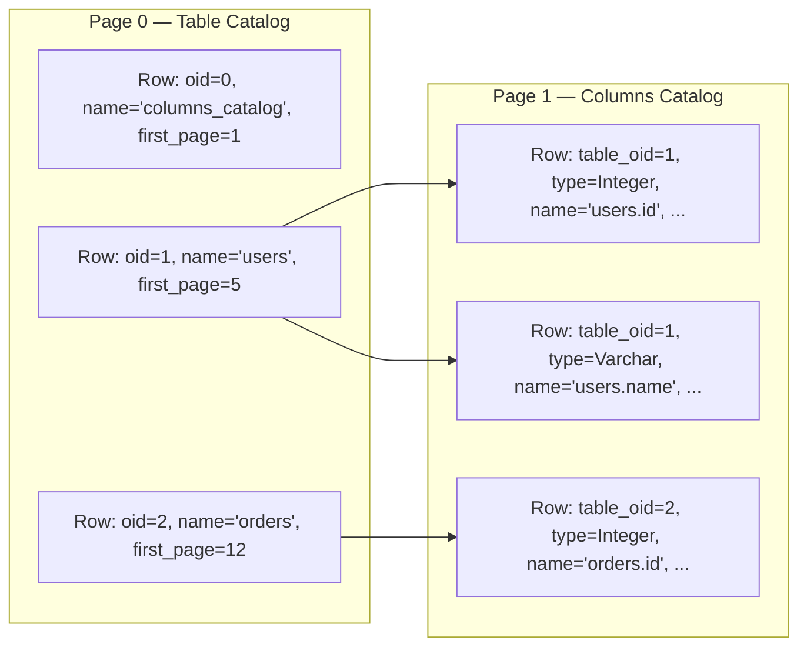
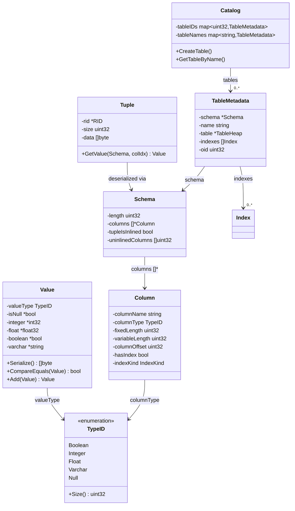

# Catalog, Type System, and Schema

> Foundation vocabulary for SamehadaDB: types, values, columns, schemas, tuples, catalog tables, and statistics.

## Overview

Every SQL table in SamehadaDB is described by metadata stored in the **Catalog**, which itself lives in the first two pages of the database file. The type system provides a small set of concrete SQL types (`Integer`, `Float`, `Boolean`, `Varchar`) with null support, comparison, and binary serialization. Schemas compose columns into a fixed-offset layout that drives tuple serialization.

Key source files:

| Component | File |
|---|---|
| Catalog | `lib/catalog/table_catalog.go` |
| TableMetadata | `lib/catalog/table_metadata.go` |
| Catalog schemas | `lib/catalog/schemas.go` |
| Statistics | `lib/catalog/statistics.go` |
| Schema | `lib/storage/table/schema/schema.go` |
| Column | `lib/storage/table/column/column.go` |
| Value | `lib/types/column_value.go` |
| TypeID | `lib/types/column_type_id.go` |
| Tuple | `lib/storage/tuple/tuple.go` |
| StatisticsUpdater | `lib/concurrency/statistics_updater.go` |

---

## Type System

### TypeID (`lib/types/column_type_id.go`)

An `iota`-based enumeration. Only four types are actively used:

| TypeID | Value | Size (bytes) | Notes |
|--------|-------|-------------|-------|
| `Boolean` | 1 | 1 null + 1 data = 2 | |
| `Integer` | 4 | 1 null + 4 data = 5 | `int32` |
| `Float` | 7 | 1 null + 4 data = 5 | `float32` |
| `Varchar` | 8 | variable | 4-byte offset pointer in fixed region |
| `Null` | 10 | 0 | Sentinel |

Several IDs (`Tinyint`, `Smallint`, `BigInt`, `Decimal`, `Timestamp`) are defined but unused.

### Value (`lib/types/column_value.go`)

A boxed SQL value with explicit null support:

```go
type Value struct {
    valueType TypeID
    isNull    *bool     // explicit null flag
    integer   *int32
    boolean   *bool
    varchar   *string
    float     *float32
}
```

All payload fields are pointers, enabling mutation (e.g. `Swap`) and distinguishing null from zero values.

**Serialization format** — every value is serialized as `[1-byte null flag | type-specific data]`:
- `Integer` / `Float`: 1 + 4 = 5 bytes
- `Boolean`: 1 + 1 = 2 bytes
- `Varchar`: 1 + 2 (length) + N (string bytes)

**Comparisons** are null-safe: `null == null` is true; `null < x` is false. Infinity sentinels (`SetInfMax`/`SetInfMin`) are used for range-estimation boundaries in statistics.

**Arithmetic**: `Add`, `Sub`, `Max`, `Min` operate on numeric types and are used by the optimizer and aggregation executor.

---

## Column (`lib/storage/table/column/column.go`)

A `Column` describes one field in a schema:

```go
type Column struct {
    columnName        string                        // "tablename.colname" (lowercase)
    columnType        types.TypeID
    fixedLength       uint32                        // Varchar: 4 (pointer); others: TypeID.Size()
    variableLength    uint32                        // Varchar: 255; others: 0
    columnOffset      uint32                        // byte offset in tuple's fixed region
    hasIndex          bool
    indexKind         index_constants.IndexKind
    indexHeaderPageID types.PageID                  // -1 if no index
    isLeft            bool                          // join planner: left-table marker
    expr              interface{}                   // expression for computed/temporary columns
}
```

- `IsInlined()` returns `false` only for `Varchar`. Inlined columns are stored directly at their offset; Varchar stores a 4-byte pointer to the variable-length region.
- Column names are always lowercase and qualified with the table name (e.g. `"orders.amount"`).
- Index metadata (kind, header page ID) is persisted alongside the column in the catalog.

---

## Schema (`lib/storage/table/schema/schema.go`)

A `Schema` is an ordered list of columns with precomputed offsets:

```go
type Schema struct {
    length           uint32          // total fixed-region size
    columns          []*column.Column
    tupleIsInlined   bool            // true if no Varchar columns
    uninlinedColumns []uint32        // indices of Varchar columns
}
```

`NewSchema` iterates columns, assigning cumulative offsets. Inlined columns get sequential offsets in the fixed region. Varchar columns are tracked in `uninlinedColumns` for special handling during tuple serialization.

Column lookup by name (`GetColIndex`) is case-insensitive and supports both qualified (`"table.col"`) and bare (`"col"`) names.

---

## Tuple Format (`lib/storage/tuple/tuple.go`)

A `Tuple` is a compact binary blob holding one row's data:

```go
type Tuple struct {
    rid  *page.RID    // (pageID, slotNum) — set after insertion
    size uint32       // total byte length
    data []byte       // serialized payload
}
```

### Binary layout

```
+---------------------------------------------+----------------------------+
| FIXED-SIZE REGION (schema.Length() bytes)     | VARIABLE-LENGTH REGION     |
+---------------------------------------------+----------------------------+
| col0 data | col1 data | ... | varchar_ptr   | varchar_string_bytes ...   |
+---------------------------------------------+----------------------------+
                              ↑                  ↑
                              └── 4-byte offset ─┘
```

- **Inlined columns** (Integer, Float, Boolean): serialized directly at `column.GetOffset()`.
- **Varchar columns**: a `uint32` offset is written at the column's position in the fixed region; the actual string bytes are appended in the variable-length region.

`NewTupleFromSchema(values, schema)` builds this layout. `GetValue(schema, colIndex)` reverses it: reads the offset, then deserializes the value.

`GenTupleForIndexSearch` creates a partial tuple with a single column populated and dummies elsewhere — used for index key construction.

---

## Catalog (`lib/catalog/table_catalog.go`)

The Catalog manages table metadata and persists it in two reserved pages.

### Catalog page layout



**Page 0** stores one row per table: `(oid, name, first_page)`.
**Page 1** stores one row per column: `(table_oid, type, name, fixed_length, variable_length, offset, has_index, index_kind, index_header_page_id)`.

Both pages use the standard `TableHeap` / `TablePage` slotted format (see [03_buffer_storage.md](03_buffer_storage.md)).

### Catalog struct

```go
type Catalog struct {
    bpm             *buffer.BufferPoolManager
    tableIDs        map[uint32]*TableMetadata     // OID → metadata
    tableNames      map[string]*TableMetadata     // lowercase name → metadata
    nextTableID     uint32                        // atomic OID counter
    tableHeap       *access.TableHeap             // heap at page 0
    LogManager      *recovery.LogManager
    LockManager     *access.LockManager
    tableIDsMutex   *sync.Mutex
    tableNamesMutex *sync.Mutex
}
```

### Bootstrap (`BootstrapCatalog`)

Called on first database creation:
1. Create a `TableHeap` at page 0 (the table catalog itself).
2. Initialize empty ID/name maps.
3. Create the `columns_catalog` table at page 1 using `ColumnsCatalogSchema()`.

### Recovery (`RecoveryCatalogFromCatalogPage`)

Called on restart:
1. Scan page 0 to reconstruct all table OIDs, names, and first-page IDs.
2. For each table, scan page 1 to reconstruct column definitions (type, length, offset, index info).
3. Rebuild `TableMetadata` and `TableHeap` for each table.
4. Recreate index objects from persisted header page IDs.

### CreateTable

```go
func (c *Catalog) CreateTable(name string, sc *schema.Schema, txn *access.Transaction) *TableMetadata
```

1. Lowercase the table name.
2. Atomically allocate a new OID.
3. Create a new `TableHeap`.
4. Prefix column names with the table name (e.g. `"col1"` → `"tablename.col1"`).
5. Insert rows into page 0 (table entry) and page 1 (column entries).
6. Flush both pages to ensure durability.

### Lookup

- `GetTableByName(name)` — O(1) via `tableNames` map (lowercase key).
- `GetTableByOID(oid)` — O(1) via `tableIDs` map.

---

## TableMetadata (`lib/catalog/table_metadata.go`)

Bundles a table's schema, heap, indexes, and statistics:

```go
type TableMetadata struct {
    schema   *schema.Schema
    name     string
    table    *access.TableHeap
    indexes  []index.Index         // one per column (nil if no index)
    statiscs *TableStatistics
    oid      uint32
}
```

### Index creation during construction

`NewTableMetadata` inspects each column. If `HasIndex()` is true, it creates the appropriate index object:

| `IndexKind` | Implementation | Notes |
|---|---|---|
| Hash | `NewLinearProbeHashTableIndex` | Fixed bucket count |
| SkipList | `NewSkipListIndex` | Non-unique; composite key technique |
| UniqueSkipList | `NewUniqSkipListIndex` | Unique constraint enforcement |
| BTree | `NewBTreeIndex` | External `bltree` library |

On first creation, pages are allocated and the header page ID is stored in the column metadata. On recovery, existing indexes are restored from saved header page IDs.

The `indexes` slice has the same length as the column count; columns without indexes have `nil` entries. See [04_index.md](04_index.md) for index internals.

---

## Statistics (`lib/catalog/statistics.go`)

### TableStatistics

One `columnStats` per column, tracking:
- `max`, `min` — observed range boundaries (`*types.Value`)
- `count` — total row count
- `distinct` — distinct value count
- `latch` — `ReaderWriterLatch` for concurrent access

### Update cycle

`Update(tableMetadata, txn)` scans the entire table heap, builds `distinctCounter` maps per column, then copies results into `columnStats`. Called by the background `StatisticsUpdater`.

### Query optimizer support

- **`ReductionFactor(expression)`** — estimates selectivity of WHERE clauses. Returns the factor by which a predicate reduces row count. Handles equality (uses distinct count), AND (multiplies factors), OR (combines).
- **`EstimateCount(from, to, colIndex)`** — range cardinality estimation for numeric types using `(to - from) / distinct * count`, clamped to observed min/max.
- **`TransformBy`**, **`Multiply`**, **`Concat`** — scale and combine statistics during join planning.

### StatisticsUpdater (`lib/concurrency/statistics_updater.go`)

A background goroutine that refreshes statistics every 10 seconds:

```
loop:
    txn = Begin()
    for each table in catalog:
        table.statistics.Update(table, txn)
    Commit(txn)
    Sleep(10s)
```

Uses a dedicated transaction. If the transaction aborts mid-scan, partial updates are retained. The reader-writer latch on each `columnStats` allows the optimizer to read consistent snapshots while the updater writes.

---

## Type system class relationships



---

## Design Decisions

1. **Self-describing catalog**: Catalog tables use the same `TableHeap`/`TablePage` format as user tables. This means recovery can use identical deserialization logic — no special-case code for catalog pages.

2. **Lowercase normalization**: All table and column names are stored lowercase. This simplifies case-insensitive SQL without runtime conversion during lookups.

3. **Qualified column names**: Columns are stored as `"tablename.colname"`. This prevents ambiguity in joins and allows the planner to resolve columns without extra context.

4. **Pointer-based Value fields**: Using `*int32` / `*string` etc. distinguishes null from zero values and enables in-place mutation. The trade-off is heap allocation per value.

5. **Fixed + variable tuple layout**: The two-region tuple format (fixed offsets + variable data) gives O(1) access to any column in the fixed region while supporting variable-length strings.

6. **Index metadata in column**: Storing `hasIndex`, `indexKind`, and `indexHeaderPageID` directly in the column metadata (persisted in page 1) means index recovery needs no additional catalog pages.

7. **Background statistics**: Running statistics collection in a separate goroutine with RW latches avoids blocking user queries while providing reasonably fresh data for the optimizer.

---

## Extension Guidelines

- **Adding a new type**: Add a `TypeID` constant, implement `Size()`, add serialization/deserialization cases in `Value`, and handle the type in `Column.fixedLength`/`variableLength` computation.
- **Adding a new catalog attribute**: Add a column to `TableCatalogSchema()` or `ColumnsCatalogSchema()` in `lib/catalog/schemas.go`, update `insertTable` and recovery logic in `table_catalog.go`.
- **Adding a computed/virtual column**: Use the `expr` field in `Column` with a new expression type (see [02_execution_engine.md](02_execution_engine.md) for the expression system).
